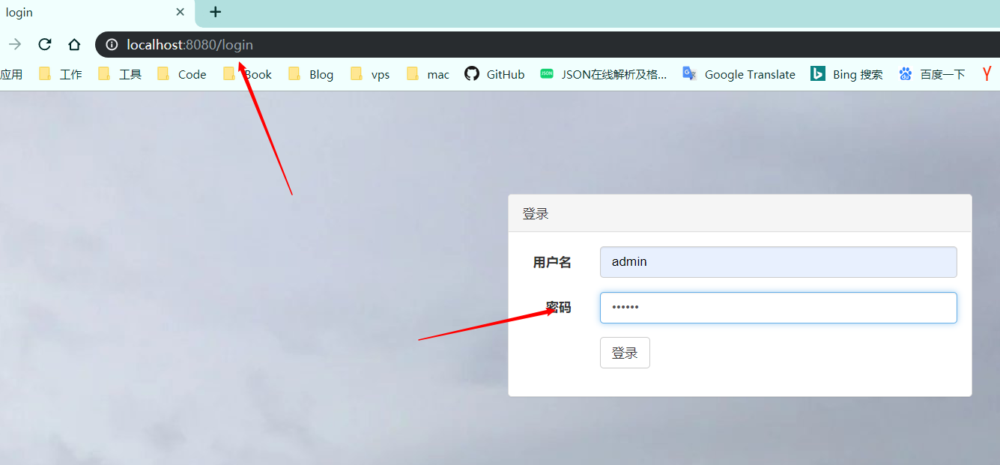

## SpringBoot整合Shiro-Authentication-加密认证

### 1.添加依赖

```java
<dependencies>
        <dependency>
            <groupId>org.springframework.boot</groupId>
            <artifactId>spring-boot-starter-web</artifactId>
        </dependency>
        <!--mysql驱动-->
        <dependency>
            <groupId>mysql</groupId>
            <artifactId>mysql-connector-java</artifactId>
            <scope>runtime</scope>
        </dependency>
        <!--mybatis-->
        <dependency>
            <groupId>org.mybatis.spring.boot</groupId>
            <artifactId>mybatis-spring-boot-starter</artifactId>
            <version>RELEASE</version>
        </dependency>
        <!-- druid数据源驱动 -->
        <dependency>
            <groupId>com.alibaba</groupId>
            <artifactId>druid-spring-boot-starter</artifactId>
            <version>RELEASE</version>
        </dependency>

        <!-- shiro-spring -->
        <dependency>
            <groupId>org.apache.shiro</groupId>
            <artifactId>shiro-spring</artifactId>
            <version>RELEASE</version>
        </dependency>
		<!--thymeleaf模板-->
        <dependency>
            <groupId>org.springframework.boot</groupId>
            <artifactId>spring-boot-starter-thymeleaf</artifactId>
            <version>RELEASE</version>
        </dependency>
		
        <dependency>
            <groupId>org.springframework.boot</groupId>
            <artifactId>spring-boot-starter-test</artifactId>
            <scope>test</scope>
        </dependency>
    </dependencies>
```

### 2.执行sql脚本，建立相关表结构和数据

在数据库执行init.sql

### 3.配置application.yml

```java
server:
  servlet:
    context-path: /

spring:
  datasource:
    druid:
      # 数据库访问配置, 使用druid数据源
      url: jdbc:mysql://127.0.0.1:3306/springboot_shiro_jwt?characterEncoding=utf8&useSSL=false&serverTimezone=UTC&zeroDateTimeBehavior=CONVERT_TO_NULL
      username: root
      password: root
      # 连接池配置
      initial-size: 5
      min-idle: 5
      max-active: 20
      # 连接等待超时时间
      max-wait: 30000
      # 配置检测可以关闭的空闲连接间隔时间
      time-between-eviction-runs-millis: 60000
      # 配置连接在池中的最小生存时间
      min-evictable-idle-time-millis: 300000
      validation-query: select '1' from dual
      test-while-idle: true
      test-on-borrow: false
      test-on-return: false
      # 打开PSCache，并且指定每个连接上PSCache的大小
      pool-prepared-statements: true
      max-open-prepared-statements: 20
      max-pool-prepared-statement-per-connection-size: 20
      # 配置监控统计拦截的filters, 去掉后监控界面sql无法统计, 'wall'用于防火墙
      filters: stat
      # Spring监控AOP切入点，如x.y.z.service.*,配置多个英文逗号分隔
      aop-patterns: com.ty.service.*

      # WebStatFilter配置
      web-stat-filter:
        enabled: true
        # 添加过滤规则
        url-pattern: /*
        # 忽略过滤的格式
        exclusions: '*.js,*.gif,*.jpg,*.png,*.css,*.ico,/druid/*'

      # StatViewServlet配置
      stat-view-servlet:
        enabled: true
        # 访问路径为/druid时，跳转到StatViewServlet
        url-pattern: /druid/*
        # 是否能够重置数据
        reset-enable: false
        # 需要账号密码才能访问控制台
        login-username: druid
        login-password: druid123
        # IP白名单
        # allow: 127.0.0.1
        # IP黑名单（共同存在时，deny优先于allow）
        # deny: 192.168.1.218

      # 配置StatFilter
      filter:
        stat:
          log-slow-sql: true

  thymeleaf:
    cache: false


mybatis:
  # type-aliases扫描路径
  type-aliases-package: com.ty.pojo
  # mapper xml扫描路径
  mapper-locations: classpath:mapper/*.xml
  # mybatis config文件
  # config-location: classpath:mybatis.xml
```

### 4.构造基本的web分层

包括controller（转发）、service（业务逻辑）、dao（数据持久层），实现一个用户登录简单例字，包括exception全局异常处理，登录页面由thymeleaf实现，基于SpringBootException例字扩展。

### 5.shiro核心

新建shrio配置和自定义Realm，以及md5加密处理类。

##### 1.自定义Realm

此处的自定义Realm只重写认证方法，授权等详情请看SpringBoot-Shiro-Authorization

```java
**
 * @ClassName: CustomRealm
 * @Description: 自定义Realm
 * @author zhangtainyi
 * @date 2019/8/27 15:29
 *
 */
public class CustomRealm extends AuthorizingRealm {

    private Logger log = LoggerFactory.getLogger(CustomRealm.class);
    @Resource
    private UserService userService;


    //登录认证
    @Override
    protected AuthenticationInfo doGetAuthenticationInfo(AuthenticationToken authenticationToken) throws AuthenticationException {
        //1.从主体传过来的授权信息中，获取用户名
        String usernmae = (String) authenticationToken.getPrincipal();
        //2.通过用户名到数据库中获取用户数据
        User user = userService.findByUsername(usernmae);
        if(user == null){
            throw new UnknownAccountException("用户名或密码错误");
        }
        SimpleAuthenticationInfo authenticationInfo = new SimpleAuthenticationInfo(usernmae, user.getPassword(), getName());//构建用户认证信息
        //如果算法加盐了，就需要在返回authenticationInfo对象前设置盐
        authenticationInfo.setCredentialsSalt(ByteSource.Util.bytes(user.getUsername()));
        return authenticationInfo;

    }
    //获取权限
    @Override
    protected AuthorizationInfo doGetAuthorizationInfo(PrincipalCollection principalCollection) {
        return null;
    }
}
```

##### 2.自定义Shiro config

```java
@Configuration
public class ShiroConfig {
    //将自定义realm让spring管理
    @Bean
    public CustomRealm customRealm(){
        CustomRealm customRealm = new CustomRealm();
        //添加算法和迭代
        HashedCredentialsMatcher matcher = new HashedCredentialsMatcher("md5");
        matcher.setHashIterations(1);
        customRealm.setCredentialsMatcher(matcher);
        return customRealm;
    }
    //注入自定义realm
    @Bean
    public SecurityManager securityManager(){
        DefaultWebSecurityManager securityManager = new DefaultWebSecurityManager();
        securityManager.setRealm(customRealm());
        return securityManager;
    }
    //配置shiro的web过滤器,是shiro的核心配置,shiro的所有功能都基于这个对象
    @Bean
    public ShiroFilterFactoryBean shiroFilterFactoryBean(SecurityManager securityManager) {
        ShiroFilterFactoryBean shiroFilterFactoryBean = new ShiroFilterFactoryBean();
        shiroFilterFactoryBean.setSecurityManager(securityManager);
        shiroFilterFactoryBean.setLoginUrl("/login");
        shiroFilterFactoryBean.setSuccessUrl("/index");
        shiroFilterFactoryBean.setUnauthorizedUrl("/403");

        LinkedHashMap<String, String> filterChainDefinitionMap = new LinkedHashMap<>();

        filterChainDefinitionMap.put("/css/**", "anon");
        filterChainDefinitionMap.put("/js/**", "anon");
        filterChainDefinitionMap.put("/fonts/**", "anon");
        filterChainDefinitionMap.put("/img/**", "anon");
        filterChainDefinitionMap.put("/druid/**", "anon");
        filterChainDefinitionMap.put("/login","anon");
        filterChainDefinitionMap.put("/logout", "logout");
        filterChainDefinitionMap.put("/", "anon");
        filterChainDefinitionMap.put("/**", "authc");

        shiroFilterFactoryBean.setFilterChainDefinitionMap(filterChainDefinitionMap);

        return shiroFilterFactoryBean;
    }
}
```

- 自定义Realm注入spring容器，添加算法和迭代
- 将自定义Realm注入SecurityManager，并将SecurityManager交由spring管理
- 配置shiro的web过滤器,是shiro的核心配置,shiro的所有功能都基于这个对象，将SecurityManager注入
- 配置shiro的web过滤器的基本配置

##### 3.修改UserController

```java
@Controller
public class UserController {
    private Logger logger = LoggerFactory.getLogger(UserController.class);

    @GetMapping("/login")
    public String login(){
        //如果已经认证通过，直接跳转到首页
        if (SecurityUtils.getSubject().isAuthenticated()) {
            return "redirect:/index";
        }
        return "login";
    }

    @PostMapping("/login")
    public String login(User user) throws Exception{
        logger.info("开始认证...");
        Subject subject = SecurityUtils.getSubject();
        UsernamePasswordToken token = new UsernamePasswordToken(user.getUsername(), user.getPassword());
        subject.login(token);//登录认证
        logger.info("结束认证...");
        return "redirect:/index";
    }

    @RequestMapping("/logout")
    public String logout(){
        return "login";
    }

    @RequestMapping("/")
    public String redirectIndex(){
        return "redirect:/index";
    }

    @RequestMapping("/index")
    public String index(Model model) {
        User user = (User) SecurityUtils.getSubject().getPrincipal();
        model.addAttribute("user", user);
        return "index";
    }
}
```

### 6.测试

启动springboot，进入登录页输入正确账号密码。



结果跳转到index页面,页面获取到用户名并显示。


点击注销退出登录，再次回到登录页，输入错误的密码登录。


