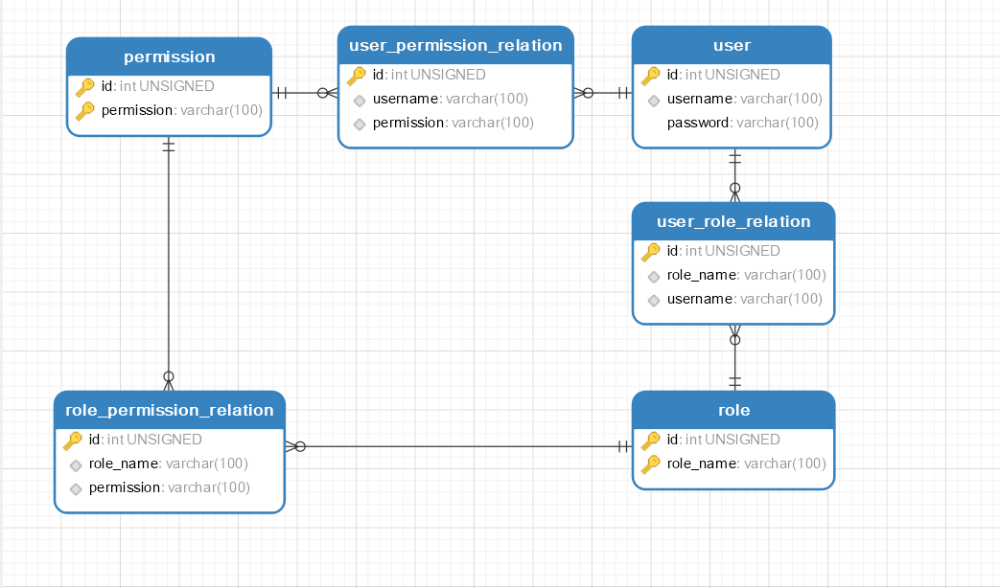
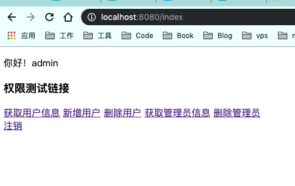
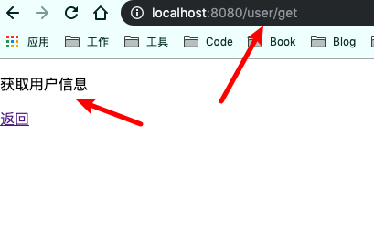
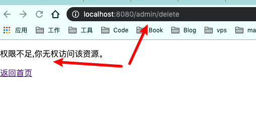

# SpringBoot整合Shiro-Authorization-权限控制

紧接上一篇教程SpringBoot整合Shiro-RememberMe-记住我，新增Authorization功能。shiro认证中我们继承了AuthorizingRealm抽象类实现了`doGetAuthenticationInfo()`方法完成用户认证，同样的我们可以继承AuthorizingRealm抽象类中的`doGetAuthorizationInfo()` 方法完成用户权限控制。

Shiro的核心就是用户、角色、权限，授权是获取用户的角色和权限。

## 数据库设计

这里使用RBAC（Role-Based Access Control，基于角色访问控制）模型设计数据库表。增加了一个`user_permission_relation`表，扩展用户的权限，传统的是用户角色关联表，角色权限关联表。



执行sql语句（建表并插入测试数据）：

```java
/*==============================================================*/
/* DBMS name:      MySQL 5.0                                    */
/* Created on:     2019/8/27 14:06:07                           */
/*==============================================================*/


drop table if exists permission;

drop table if exists role;

drop table if exists role_permission_relation;

drop table if exists user;

drop table if exists user_permission_relation;

drop table if exists user_role_relation;

/*==============================================================*/
/* Table: permission                                            */
/*==============================================================*/
create table permission
(
   id                   int unsigned not null auto_increment,
   permission           varchar(100) not null,
   primary key (id, permission)
);

/*==============================================================*/
/* Index: permission                                            */
/*==============================================================*/
create index permission on permission
(
   permission
);

/*==============================================================*/
/* Table: role                                                  */
/*==============================================================*/
create table role
(
   id                   int unsigned not null auto_increment,
   role_name            varchar(100) not null,
   primary key (id, role_name)
);

/*==============================================================*/
/* Index: role_name                                             */
/*==============================================================*/
create index role_name on role
(
   role_name
);

/*==============================================================*/
/* Table: role_permission_relation                              */
/*==============================================================*/
create table role_permission_relation
(
   id                   int unsigned not null auto_increment,
   role_name            varchar(100) not null,
   permission           varchar(100) not null,
   primary key (id)
);

alter table role_permission_relation comment '用户角色和权限关系表，角色与权限是多对多关系';

/*==============================================================*/
/* Table: user                                                  */
/*==============================================================*/
create table user
(
   id                   int unsigned not null auto_increment,
   username             varchar(100) not null,
   password             varchar(100) not null,
   primary key (id)
);

/*==============================================================*/
/* Index: username                                              */
/*==============================================================*/
create index username on user
(
   username
);

/*==============================================================*/
/* Table: user_permission_relation                              */
/*==============================================================*/
create table user_permission_relation
(
   id                   int unsigned not null auto_increment,
   username             varchar(100) not null,
   permission           varchar(100) not null,
   primary key (id)
);

alter table user_permission_relation comment '用户和权限关系表(除角色中定义的权限以外的加减权限)，加权限是指用户比角色多出的权限，减权限是指用户比角色少的权限';

/*==============================================================*/
/* Table: user_role_relation                                    */
/*==============================================================*/
create table user_role_relation
(
   id                   int unsigned not null auto_increment,
   role_name            varchar(100) not null,
   username             varchar(100) not null,
   primary key (id)
);

alter table user_role_relation comment '用户和角色关系表，用户与角色是多对多关系';

alter table role_permission_relation add constraint FK_ROLE_PERMISSION_1 foreign key (role_name)
      references role (role_name) on delete cascade on update cascade;

alter table role_permission_relation add constraint FK_ROLE_PERMISSION_2 foreign key (permission)
      references permission (permission) on delete cascade on update cascade;

alter table user_permission_relation add constraint FK_USER_PERMISSION_1 foreign key (username)
      references user (username) on delete cascade on update cascade;

alter table user_permission_relation add constraint FK_USER_PERMISSION_2 foreign key (permission)
      references permission (permission) on delete cascade on update cascade;

alter table user_role_relation add constraint FK_USER_ROLE_1 foreign key (username)
      references user (username) on delete cascade on update cascade;

alter table user_role_relation add constraint FK_USER_ROLE_2 foreign key (role_name)
      references role (role_name) on delete cascade on update cascade;

DELETE FROM `user` WHERE `username` = 'ty' AND `password` = '72da43b6f18c8c03b59f387e6bece8b3';
DELETE FROM `user` WHERE `username` = 'admin' AND `password` = 'a66abb5684c45962d887564f08346e8d';
INSERT INTO `user`(`username`, `password`) VALUES ('ty', '72da43b6f18c8c03b59f387e6bece8b3');
INSERT INTO `user`(`username`, `password`) VALUES ('admin', 'a66abb5684c45962d887564f08346e8d');

DELETE FROM `role` WHERE `role_name` = 'admin';
DELETE FROM `role` WHERE `role_name` = 'user';
INSERT INTO `role`(`role_name`) VALUES ('admin');
INSERT INTO `role`(`role_name`) VALUES ('user');

DELETE FROM `permission` WHERE `permission` = 'user:get';
DELETE FROM `permission` WHERE `permission` = 'user:post';
DELETE FROM `permission` WHERE `permission` = 'user:put';
DELETE FROM `permission` WHERE `permission` = 'user:delete';
DELETE FROM `permission` WHERE `permission` = 'user:*';
DELETE FROM `permission` WHERE `permission` = 'admin:get';
INSERT INTO `permission`(`permission`) VALUES ('user:get');
INSERT INTO `permission`(`permission`) VALUES ('user:post');
INSERT INTO `permission`(`permission`) VALUES ('user:put');
INSERT INTO `permission`(`permission`) VALUES ('user:delete');
INSERT INTO `permission`(`permission`) VALUES ('user:*');
INSERT INTO `permission`(`permission`) VALUES ('admin:get');

DELETE FROM `user_role_relation` WHERE `role_name` = 'admin' AND `username` = 'admin';
DELETE FROM `user_role_relation` WHERE `role_name` = 'user' AND `username` = 'ty';
INSERT INTO `user_role_relation`(`username`, `role_name`) VALUES ('admin', 'admin');
INSERT INTO `user_role_relation`(`username`, `role_name`) VALUES ('ty', 'user');

DELETE FROM `role_permission_relation` WHERE `role_name` = 'admin' AND `permission` = 'user:*';
DELETE FROM `role_permission_relation` WHERE `role_name` = 'user' AND `permission` = 'user:get';
INSERT INTO `role_permission_relation`(`role_name`, `permission`) VALUES ('admin', 'user:*');
INSERT INTO `role_permission_relation`(`role_name`, `permission`) VALUES ('user', 'user:get');

DELETE FROM `user_permission_relation` WHERE `username` = 'admin' AND `permission` = 'admin:get';
DELETE FROM `user_permission_relation` WHERE `username` = 'user' AND `permission` = 'user:put';
INSERT INTO `user_permission_relation`(`username`, `permission`) VALUES ('admin', 'admin:get');
INSERT INTO `user_permission_relation`(`username`, `permission`) VALUES ('ty', 'user:put');
```

一共创建了6张表，包括用户表、角色表、权限表、用户角色关联表、角色权限关联表、用户角色关联表（额外增加，可以灵活的给用户增加额外权限）。测试数据中admin用户有admin角色，admin角色有`user:*`权限（user的所有权限），用户权限关联表额外增加了admin用户对admin查询的权限`admin:get`。用户表中的密码都是已经经过MD5加密的。

## 数据持久层（Dao层）

### 需要在pojo包中新建两个实体Role和Permission

**Role实体**

```java
public class Role {

  private int id;
  private String roleName;
  //getter/setter方法省略
}
```

**Permission实体**

```java
public class Permission {

  private int id;
  private String permission;
}
```

### 创建两个Dao接口，分别用户查询用户的角色集合和权限集合

**UserRoleMapper查询用户所有角色**

```java
@Mapper
public interface UserRoleMapper {
    Set<String> findRolesByUsername(String username);
}
```

**UserRoleMapperXml**(**接口对应的xml**)

```xml
<?xml version="1.0" encoding="UTF-8"?>
<!DOCTYPE mapper PUBLIC "-//mybatis.org//DTD Mapper 3.0//EN" "http://mybatis.org/dtd/mybatis-3-mapper.dtd">
<mapper namespace="com.ty.dao.UserRoleMapper">

<resultMap type="Role" id="Role">
   <id column="id" property="id" javaType="java.lang.Integer" jdbcType="NUMERIC"/>
   <id column="role_name" property="roleName" javaType="java.lang.String" jdbcType="VARCHAR"/>
</resultMap>

<select id="findRolesByUsername" resultType="String">
	SELECT role_name FROM user_role_relation WHERE username = #{username}
</select>

</mapper>
```

**UserPermsMapper查询用户所有的权限**（**包括用户权限关联表的权限数据**）

```java
@Mapper
public interface UserPermsMapper {
    Set<String> findPermsByUsername(User user);
}
```

**UserPermsMapperXml**(**接口对应的xml**)

```xml
<?xml version="1.0" encoding="UTF-8"?>
<!DOCTYPE mapper PUBLIC "-//mybatis.org//DTD Mapper 3.0//EN" "http://mybatis.org/dtd/mybatis-3-mapper.dtd">
<mapper namespace="com.ty.dao.UserPermsMapper">

<resultMap type="Permission" id="Permission">
   <id column="id" property="id" javaType="java.lang.Integer" jdbcType="NUMERIC"/>
   <id column="permission" property="permission" javaType="java.lang.String" jdbcType="VARCHAR"/>
</resultMap>

<select id="findPermsByUsername" resultType="string">
    SELECT
        permission
    FROM
        role_permission_relation
    WHERE
        role_name IN ( SELECT role_name FROM user_role_relation WHERE username = #{username} ) UNION
    SELECT
        permission
    FROM
        user_permission_relation
    WHERE
        username = #{username}
</select>

</mapper>
```

## 修改自定义Realm

在Shiro中，用户角色和权限的获取是在Realm的`doGetAuthorizationInfo`方法中实现，所以重写该方法。

```java
/**
 * @ClassName: CustomRealm
 * @Description: 自定义Realm
 * @author zhangtainyi
 * @date 2019/8/27 15:29
 *
 */
public class CustomRealm extends AuthorizingRealm {

    private Logger logger = LoggerFactory.getLogger(CustomRealm.class);
    @Resource
    private UserService userService;
    @Resource
    private UserRoleService userRoleService;
    @Resource
    private UserPermsService userPermsService;


    //登录认证
    @Override
    protected AuthenticationInfo doGetAuthenticationInfo(AuthenticationToken authenticationToken) throws AuthenticationException {
        logger.info("-----doGetAuthenticationInfo 开始-----");
        //1.从主体传过来的授权信息中，获取用户名
        String usernmae = (String) authenticationToken.getPrincipal();
        //2.通过用户名到数据库中获取角色权限数据
        User user = userService.findByUsername(usernmae);
        if(user == null){
            throw new UnknownAccountException("用户名或密码错误");
        }
        SimpleAuthenticationInfo authenticationInfo = new SimpleAuthenticationInfo(user, user.getPassword(), getName());
        //返回authenticationInfo对象前设置盐
        authenticationInfo.setCredentialsSalt(ByteSource.Util.bytes(user.getUsername()));
        logger.info("-----doGetAuthenticationInfo 结束-----");
        return authenticationInfo;

    }
    //获取权限
    @Override
    protected AuthorizationInfo doGetAuthorizationInfo(PrincipalCollection principalCollection) {
        //1.从主体传过来的认证信息中，获取用户对象
        User user = (User)principalCollection.getPrimaryPrincipal();
        //通过用户名到数据库获取角色和权限
        Set<String> roles = userRoleService.getRoleByUsername(user.getUsername());
        Set<String> permissions = userPermsService.getPermsByusername(user);
        //构造对象返回加上角色权限
        SimpleAuthorizationInfo authorizationInfo = new SimpleAuthorizationInfo();
        authorizationInfo.setRoles(roles);//角色
        authorizationInfo.setStringPermissions(permissions);//权限
        return authorizationInfo;

    }
}
```

重写`doGetAuthorizationInfo`方法，通过service层调用dao接口方法，`userRoleService.getRoleByUsername(user.getUsername());`和`userPermsService.getPermsByusername(user);`获取当前用户的所有角色和所有权限，将角色集合和权限集合保存到SimpleAuthorizationInfo对象中，返回给Shiro，Shiro会自动帮我们记录信息。

## 修改ShiroConfig

Shiro为我们提供了一些和权限相关的注解，如下所示：

```java
// 表示当前Subject已经通过login进行了身份验证；即Subject.isAuthenticated()返回true。
@RequiresAuthentication  
 
// 表示当前Subject已经身份验证或者通过记住我登录的。
@RequiresUser  

// 表示当前Subject没有身份验证或通过记住我登录过，即是游客身份。
@RequiresGuest  

// 表示当前Subject需要角色admin和user。  
@RequiresRoles(value={"admin", "user"}, logical= Logical.AND)  
// 表示当前Subject需要权限user:get或user:post。
@RequiresPermissions (value={"user:get", "user:post"}, logical= Logical.OR)
```

这些注解基于aop实现，要开启这些注解还需要在ShiroConfig中配置：

```java
    /**
     * 开启shiro注解
     * @param securityManager
     * @return
     */
    @Bean
    public AuthorizationAttributeSourceAdvisor authorizationAttributeSourceAdvisor(SecurityManager securityManager){
        AuthorizationAttributeSourceAdvisor authorizationAttributeSourceAdvisor = new
                AuthorizationAttributeSourceAdvisor();
        authorizationAttributeSourceAdvisor.setSecurityManager(securityManager);
        return authorizationAttributeSourceAdvisor;
    }
```

## Controller层

新建两个controller负责分发，AdminController和UserController，并使用Shiro注解控制权限。

**AdminController**

```java
@Controller
@RequestMapping("admin")
public class AdminController {

    @RequiresPermissions("admin:get")
    @RequestMapping("get")
    public String adminGet(Model model) {
        model.addAttribute("value", "获取管理员信息");
        return "admin";
    }

    @RequiresPermissions("admin:delete")
    @RequestMapping("delete")
    public String adminDelete(Model model) {
        model.addAttribute("value", "删除管理员");
        return "admin";
    }
}
```

**UserController**

```java
@Controller
@RequestMapping("/user")
public class UserController {
    @Resource
    private UserRoleMapper userRoleMapper;
    @Resource
    private UserPermsMapper userPermsMapper;

    @RequiresPermissions("user:user")
    @RequestMapping("get")
    public String userQuery(Model model) {
        model.addAttribute("value", "获取用户信息");
        return "user";
    }

    @RequiresPermissions("user:add")
    @RequestMapping("add")
    public String userAdd(Model model) {
        model.addAttribute("value", "新增用户");
        return "user";
    }

    @RequiresPermissions("user:delete")
    @RequestMapping("delete")
    public String userDelete(Model model) {
        model.addAttribute("value", "删除用户");
        return "user";
    }
}
```

在LoginController中需要添加一个重定向到403页面的URL

```java
    @GetMapping("/403")
    public String forbid() {
        return "403";
    }
```

**问题**

为什么ShiroConfig中定义了`shiroFilterFactoryBean.setUnauthorizedUrl("/403");`没有权限跳转/403。

因为ShiroConfig中设置的只对filterChain有效，例如你在filterChain中设置了`filterChainDefinitionMap.put("/admin/delete", perms[admin:delete]);`，此时如果用户没有`admin:delete`权限，那么当其访问该URL时，页面会被重定向到/403.

此时可以使用针对无权限异常的处理类

```java
@ControllerAdvice
public class ShiroExceptionHandler {
    private Logger logger = LoggerFactory.getLogger(ShiroExceptionHandler.class);

    /**
     * 对shiro认证抛出的异常统一处理
     */
    @ExceptionHandler(AuthenticationException.class)
    public ResponseData handleAuthenticationException(HttpServletRequest request,
             HttpServletResponse response, Exception e) throws IOException {

        //系统异常打印
        logger.error(e.getMessage());
        if(e instanceof UnknownAccountException){
            return ResponseUtil.failure(401,"用户名不存在");
        }else if(e instanceof IncorrectCredentialsException){
            return ResponseUtil.failure(401,"用户名或密码错误");
        }
        return ResponseUtil.failure(401,"认证失败！");//异常回传信息
    }
    /**
     * 对shiro授权抛出的异常统一处理
     */
    @ExceptionHandler(AuthorizationException.class)
    public String handleAuthorizationException(HttpServletRequest request,
             HttpServletResponse response, Exception e) throws IOException {
        //系统异常打印
        logger.error(e.getMessage());
        return "403";
    }

}
```

此时如果没有权限会统一处理，跳转到URL/403。 


## html页面

### 改造index.html改造，添加URL资源访问超链接。

```html
<!DOCTYPE html>
<html xmlns:th="http://www.thymeleaf.org">
<head>
    <meta charset="UTF-8">
    <title>首页</title>
</head>
<body>
<p>你好！[[${user.username}]]</p>
<h3>权限测试链接</h3>
<div>
    <a th:href="@{/user/get}">获取用户信息</a>
    <a th:href="@{/user/add}">新增用户</a>
    <a th:href="@{/user/delete}">删除用户</a>
    <a th:href="@{/admin/get}">获取管理员信息</a>
    <a th:href="@{/admin/delete}">删除管理员</a>

</div>
<a th:href="@{/logout}">注销</a>
</body>
</html>
```

### 新增admin.html

```html
<!DOCTYPE html>
<html lang="en" xmlns:th="http://www.thymeleaf.org">
<head>
    <meta charset="UTF-8">
    <title>[[${value}]]</title>
</head>
<body>
<p>[[${value}]]</p>
<a th:href="@{/index}">返回</a>
</body>
</html>
```

### user.html

```html
<!DOCTYPE html>
<html lang="en" xmlns:th="http://www.thymeleaf.org">
<head>
    <meta charset="UTF-8">
    <title>[[${value}]]</title>
</head>
<body>
<p>[[${value}]]</p>
<a th:href="@{/index}">返回</a>
</body>
</html>
```

### 403.html

```html
<!DOCTYPE html>
<html lang="en" xmlns:th="http://www.thymeleaf.org">
<head>
    <meta charset="UTF-8">
    <title>权限不足</title>
</head>
<body>
    <p>权限不足,你无权访问该资源。</p>
    <a th:href="@{/index}">返回首页</a>
</body>
</html>
```

## 测试

启动项目，登录admin的用户账户。



点击[获取用户信息](http://localhost:8080/user/get)



点击[返回](http://localhost:8080/index)，再次点击[删除管理员](http://localhost:8080/admin/delete)

