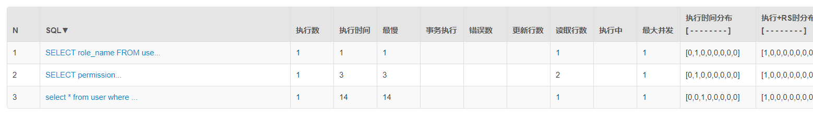

# SpringBoot整合Shiro-EhCache-使用缓存

## 问题

紧接上一篇教程SpringBoot整合Shiro-Authorization-授权，新增缓存功能，这里缓存使用EhCache。使用缓存可以避免频繁访问数据库，减轻数据库压力。Shiro并没有直接提供缓存的实现，只是对缓存进行了抽象。

在SpringBoot整合Shiro-Authorization-授权例子中，每次获取权限都需要访问数据库，可以在自定义Realm的`doGetAuthorizationInfo`中添加打印日志`logger.info("用户" + user.getUsername() + "获取权限...doGetAuthorizationInfo被调用了...");`，记录访问次数，也可通过druid的监控查看。

点击相同的URL，每次都会调用`doGetAuthorizationInfo`方法，此时我点击了三次，调用了三次数据库。


打开[druid监控](http://localhost:8080/druid/sql.html)，执行查询角色和权限的sql都是三次。


执行多次同样sql对数据库压力比较大，需要使用缓存来解决，这里使用EhCache实现缓存。

## EhCache

ehcache是一种第三方缓存技术，它出自hibernate，在hibernate中使用它作为数据缓存的解决方案。

ehcache与shiro做整合.

### 添加EhCache依赖

```xml
        <!--使用Cache缓存-->
        <dependency>
            <groupId>org.springframework.boot</groupId>
            <artifactId>spring-boot-starter-cache</artifactId>
        </dependency>
        <!--配置shiro和ehcache依赖-->
        <dependency>
            <groupId>org.apache.shiro</groupId>
            <artifactId>shiro-ehcache</artifactId>
            <version>RELEASE</version>
        </dependency>
```

### 新增EhCache配置文件

在src/main/resource/config路径下新增一个Ehcache配置——shiro-ehcache.xml：

这里仅使用本地磁盘做缓存存储

```xml
<?xml version="1.0" encoding="UTF-8"?>
<ehcache xmlns:xsi="http://www.w3.org/2001/XMLSchema-instance"
         xsi:noNamespaceSchemaLocation="http://ehcache.org/ehcache.xsd"
         updateCheck="false">
    <!--缓存位置-->
    <diskStore path="D:/home"/>
    <!--
        maxElementsInMemory 最大缓存元素个数
        eternal 缓存是否永久有效，一般都是false。
        timeToIdleSeconds 最长空闲时间
        timeToLiveSeconds 最长生命周期
        overflowToDisk 是否持久化到磁盘
        maxElementsOnDisk 磁盘上放的最大元素个数
        diskPersistent 磁盘上是否永久有效
        diskExpiryThreadIntervalSeconds 清理周期
        memoryStoreEvictionPolicy 清理规则，LRU最近最少使用 FIFO先进先出
        statistics 是否统计信息
     -->
    <defaultCache
            maxElementsInMemory="10000"
            eternal="false"
            timeToIdleSeconds="1200"
            timeToLiveSeconds="1200"
            overflowToDisk="true"
            maxElementsOnDisk="10000000"
            diskPersistent="false"
            diskExpiryThreadIntervalSeconds="120"
            memoryStoreEvictionPolicy="LRU"/>
    <!-- 缓存时间为1小时 -->
    <cache
            name="AuthorizationCache"
            maxEntriesLocalHeap="10000"
            eternal="false"
            timeToIdleSeconds="3600"
            timeToLiveSeconds="0"
            overflowToDisk="false"
            statistics="true" />
</ehcache>
```

此时使用的是本地缓存，缓存路径是`<diskStore path="D:/home"/>`


可以直接改为`<diskStore path="java.io.tmpdir/Tmp_EhCache" />`

### ehcache 的 diskStore path="java.io.tmpdir"

```xml
<!—设置缓存文件 .data 的创建路径。

如果该路径是 Java 系统参数，当前虚拟机会重新赋值。

下面的参数这样解释：
user.home – 用户主目录
user.dir      – 用户当前工作目录
java.io.tmpdir – 默认临时文件路径 -->
<diskStore path="java.io.tmpdir"/>
```


### 在ShiroConfig配置EhCache

```java
/**
     * 初始化EhCache对象
     * @return EhCache对象
     */
    @Bean
    public EhCacheManager ehCacheManager(){
        EhCacheManager ehCacheManager = new EhCacheManager();
        ehCacheManager.setCacheManagerConfigFile("classpath:config/shiro-ehcache.xml");
        logger.info("加载EhCache完成...");
        return ehCacheManager;
    }
    /**
     * 注入自定义realm、EhCache对象
     * @return SecurityManager
     */
    @Bean
    public DefaultWebSecurityManager securityManager(){
        DefaultWebSecurityManager securityManager = new DefaultWebSecurityManager();
        securityManager.setRealm(customRealm());//注入自定义Realm
        securityManager.setRememberMeManager(cookieRememberMeManager());//注入RememberMeManager
        securityManager.setCacheManager(ehCacheManager());//注入EhCacheManager
        return securityManager;
    }
```


### 测试

再次登录，点击[获取用户信息](http://localhost:8080/user/get)，多点几次发现，只有一行打印结果。


打开[druid监控](http://localhost:8080/druid/sql.html)（账号密码配置在application.yml）



此时整合完成。

## 注意缓存清空

- **如果用户正常退出，缓存自动清空。**

- **如果用户非正常退出，缓存自动清空。**

- **当管理员修改了用户权限，但是该用户未退出时，在默认情况下修改操作无法立即生效。此时需要手动清除缓存在权限修改后调用realm的clearCache方法清除缓存。**

  ```java
    //清除缓存
      public void clearCached() {
          PrincipalCollection principals = SecurityUtils.getSubject().getPrincipals();
          super.clearCache(principals);
      }
  ```

  
  

