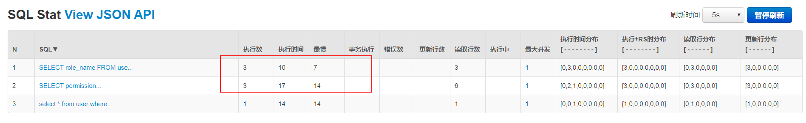
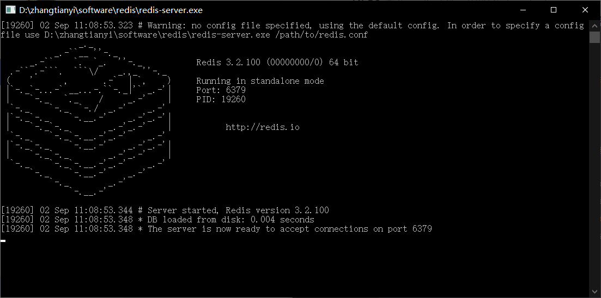

# SpringBoot整合Shiro-Cache-使用缓存

## 问题

紧接上一篇教程SpringBoot整合Shiro-EhCache-缓存，这里缓存使用Redis。

在SpringBoot整合Shiro-Authorization-授权例子中，每次获取权限都需要访问数据库，可以在自定义Realm的`doGetAuthorizationInfo`中添加打印日志`logger.info("用户" + user.getUsername() + "获取权限...doGetAuthorizationInfo被调用了...");`，记录访问次数，也可通过druid的监控查看。

点击相同的URL，每次都会调用`doGetAuthorizationInfo`方法，此时我点击了三次，调用了三次数据库。


打开[druid监控](http://localhost:8080/druid/sql.html)，执行查询角色和权限的sql都是三次。



执行多次同样sql对数据库压力比较大，需要使用缓存来解决。这里使用两种方式实现缓存EhCache和Redis。

## 基于Redis实现缓存管理

此时可以使用redis来进行缓存管理

### 添加依赖

```xml
<!--配置shiro-redis-->
        <dependency>
            <groupId>org.crazycake</groupId>
            <artifactId>shiro-redis</artifactId>
            <version>RELEASE</version>
        </dependency>
```

### 配置redis基本信息

```yml
spring:
  redis:
    host: localhost
    port: 6379
    pool:
      max-active: 8
      max-wait: -1
      max-idle: 8
      min-idle: 0
    timeout: 0
```

### 在ShiroConfig中配置Redis

```java
public RedisManager redisManager() {
    RedisManager redisManager = new RedisManager();
    return redisManager;
}

public RedisCacheManager reidsCacheManager() {
    RedisCacheManager redisCacheManager = new RedisCacheManager();
    redisCacheManager.setRedisManager(redisManager());
    return redisCacheManager;
}
```

先将RedisManager注入到reidsCacheManager，在将reidsCacheManager注入到SecurityManager中

```java
    /**
     * 注入自定义realm、EhCacheManager/ReidsCacheManager对象
     * @return SecurityManager
     */
    @Bean
    public DefaultWebSecurityManager securityManager(){
        DefaultWebSecurityManager securityManager = new DefaultWebSecurityManager();
        securityManager.setRealm(customRealm());//注入自定义Realm
        securityManager.setRememberMeManager(cookieRememberMeManager());//注入RememberMeManager
        //securityManager.setCacheManager(ehCacheManager());//注入EhCacheManager
        securityManager.setCacheManager(reidsCacheManager());//注入RedisCacheManager
        return securityManager;
    }
```

此时将注入EhCacheManager注释掉，使用ReidsCacheManager对象。

### 测试

[下载redis-windows](https://github.com/microsoftarchive/redis/releases/download/win-3.2.100/Redis-x64-3.2.100.zip)，也可以在github选取你指定版本[redis-windos](https://github.com/microsoftarchive/redis/releases)

需要先启动redis，将下载下来的zip解压，找到`redis-server.exe`双击启动

启动成功



启动springboot

同样按照上述测试过程，测试成功。

## 注意缓存清空

- **如果用户正常退出，缓存自动清空。**

- **如果用户非正常退出，缓存自动清空。**

- **当管理员修改了用户权限，但是该用户未退出时，在默认情况下修改操作无法立即生效。此时需要手动清除缓存在权限修改后调用realm的clearCache方法清除缓存。**

  ```java
    //清除缓存
      public void clearCached() {
          PrincipalCollection principals = SecurityUtils.getSubject().getPrincipals();
          super.clearCache(principals);
      }
  ```

  
  

