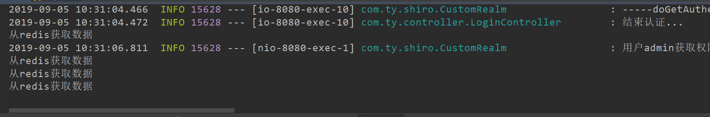

# SpringBoot整合Shiro-Cache-使用缓存

## 问题

紧接上一篇教程SpringBoot整合Shiro-RedisCache-缓存，这里缓存也使用Redis。

在SpringBoot整合Shiro-Authorization-授权例子中，每次获取权限都需要访问数据库，可以在自定义Realm的`doGetAuthorizationInfo`中添加打印日志`logger.info("用户" + user.getUsername() + "获取权限...doGetAuthorizationInfo被调用了...");`，记录访问次数，也可通过druid的监控查看。

点击相同的URL，每次都会调用`doGetAuthorizationInfo`方法，此时我点击了三次，调用了三次数据库。


打开[druid监控](http://localhost:8080/druid/sql.html)，执行查询角色和权限的sql都是三次。


执行多次同样sql对数据库压力比较大，需要使用缓存来解决。这里使用两种方式实现缓存EhCache和Redis。

## 基于Redis实现缓存管理

此时可以使用redis来进行缓存管理

### 添加依赖

治理不再使用shiro-redis的jar包，使用jedis

```xml
<!--配置jedis-->
<dependency>
    <groupId>redis.clients</groupId>
    <artifactId>jedis</artifactId>
    <version>RELEASE</version>
</dependency>
```

### 配置redis基本信息

在resource下新建一个properties文件夹，在文件夹内新建一个redis.properties文件

```properties
spring.redis.database = 0      # Redis数据库索引（默认为0）
spring.redis.host = localhost   # Redis服务器地址
spring.redis.port = 6379       # Redis服务器连接端口
spring.redis.timeout = 10000   # Redis连接超时时间
spring.redis.jedis.pool.maxActive = 5000   # 连接池最大连接数（使用负值表示没有限制）
spring.redis.jedis.pool.maxWait = 10000    # 连接池最大阻塞等待时间（使用负值表示没有限制）
spring.redis.jedis.pool.maxIdle = 5000     # 连接池中的最大空闲连接
spring.redis.jedis.pool.minIdle = 0        # 连接池中的最小空闲连接
```

### 新建一个JedisConfig配置jedis

```java
@Configuration
@PropertySource("classpath:properties/redis.properties")
public class JedisConfig {

    @Value("${spring.redis.database}")
    private String database;
    @Value("${spring.redis.host}")
    private String host;
    @Value("${spring.redis.port}")
    private Integer port;
    @Value("${spring.redis.timeout}")
    private Integer timeout;
    @Value("${spring.redis.jedis.pool.maxActive}")
    private Integer maxActive;
    @Value("${spring.redis.jedis.pool.maxWait}")
    private Integer maxWait;
    @Value("${spring.redis.jedis.pool.maxIdle}")
    private Integer maxIdle;
    @Value("${spring.redis.jedis.pool.minIdle}")
    private Integer minIdle;

    /**
     * 配置JedisPool
     * @return
     */
    @Bean
    public JedisPool jedisPool(){
        JedisPoolConfig config = new JedisPoolConfig();
        config.setMaxIdle(maxIdle);
        config.setMaxTotal(maxActive);
        config.setMaxWaitMillis(maxWait);
        config.setMinIdle(minIdle);
        JedisPool jedisPool = new JedisPool(config,host,port,timeout);
        return jedisPool;
    }
}
```

### 新建一个JedisUtil

封装一个JedisUtil工具类

```java
/**
 * redis工具类
 * 一些jedis操作方法
 */
@Component
public class JedisUtil {
    //通过jedis连接池获取redis连接
    @Resource
    private JedisPool jedisPool;
    //获取连接
    private Jedis getResource(){
        return jedisPool.getResource();
    }

    public byte[] set(byte[] key, byte[] value) {

        try (Jedis jedis = getResource()){
            jedis.set(key,value);
            return value;
        }
    }

    public int expire(byte[] key, int i) {
        try (Jedis jedis = getResource()){
            jedis.expire(key,i);
            return i;
        }
    }

    public byte[] get(byte[] key) {
        try (Jedis jedis = getResource()){
            return jedis.get(key);
        }
    }

    public void del(byte[] key) {
        try (Jedis jedis = getResource()){
            jedis.del(key);
        }
    }

    public Set<byte[]> keys(String pattern) {
        try (Jedis jedis = getResource()){
            return jedis.keys((pattern + "*").getBytes());
        }
    }

    public Set<byte[]> values(String pattern) {
        try (Jedis jedis = getResource()){
            Set<String> keys = jedis.keys(pattern + "*");
            Set<byte[]> values = new HashSet<>();
            for (String key : keys) {
                values.add(jedis.get(key).getBytes());
            }
            return values;
        }
    }
}

```

### 新建自定义RedisCache和RedisCacheManager

自定义一个RedisCache实现shiro的cache接口，并使用@Component注入spring

```java
@Component
public class RedisCache<K,V> implements Cache<K,V> {

    @Resource
    private JedisUtil jedisUtil;
    private final String CACHE_PREFIX = "redis-cache:";

    private byte[] getKey(K k){
        if(k instanceof String){
            return (CACHE_PREFIX + k).getBytes();
        }
        return SerializationUtils.serialize(k);
    }

    @Override
    public V get(K k) throws CacheException {
        System.out.println("从redis获取数据");
        byte[]value = jedisUtil.get(getKey(k));
        if(value != null){
            //在redis获取后可以存放在本地缓存中进一步提高性能，减轻redis压力
            return (V) SerializationUtils.deserialize(value);
        }
        return null;
    }

    @Override
    public V put(K k, V v) throws CacheException {
        byte[]key = getKey(k);
        byte[]value = SerializationUtils.serialize(v);
        jedisUtil.set(key,value);
        jedisUtil.expire(key,600);
        return v;
    }

    @Override
    public V remove(K k) throws CacheException {
        byte[]key = getKey(k);
        byte[]value = jedisUtil.get(key);
        jedisUtil.del(key);
        if(value != null){
            return (V) SerializationUtils.deserialize(value);
        }
        return null;
    }

    @Override
    public void clear() throws CacheException {
        //获取RedisCache所有键
        Set<byte[]> keys = jedisUtil.keys(CACHE_PREFIX);
        if(CollectionUtils.isEmpty(keys)){
            for (byte[] key : keys) {
                jedisUtil.del(key);
            }
        }
    }

    @Override
    public int size() {
        return jedisUtil.keys(CACHE_PREFIX).size();
    }

    @Override
    public Set<K> keys() {
        Set<K> keys = new HashSet<>();
        for (byte[] key : jedisUtil.keys(CACHE_PREFIX)) {
            keys.add((K) SerializationUtils.deserialize(key));
        }
        return keys;
    }

    @Override
    public Collection<V> values() {
        Set<V> values = new HashSet<>();
        for (byte[] value : jedisUtil.values(CACHE_PREFIX)) {
            values.add((V) SerializationUtils.deserialize(value));
        }
        return values;
    }
}
```

自定义RedisCacheManager用于替换默认的CacheManager

```java
public class RedisCacheManager<K,V> implements CacheManager {
    @Resource
    private RedisCache<K,V> redisCache;

    @Override
    public <K, V> Cache<K, V> getCache(String s) throws CacheException {
        return (Cache<K, V>) redisCache;
    }
}
```


### 在ShiroConfig中配置Redis

```java
/**
     * redis缓存管理器
     * @return CustomRedisCacheManager
     */
    @Bean
    public RedisCacheManager reidsCacheManager() {
        RedisCacheManager redisCacheManager = new RedisCacheManager();
        return redisCacheManager;
    }

```

先将RedisManager注入到reidsCacheManager，在将reidsCacheManager注入到SecurityManager中

```java
    /**
     * 注入自定义realm、EhCacheManager/ReidsCacheManager对象
     * @return SecurityManager
     */
    @Bean
    public DefaultWebSecurityManager securityManager(){
        DefaultWebSecurityManager securityManager = new DefaultWebSecurityManager();
        securityManager.setRealm(customRealm());//注入自定义Realm
        securityManager.setRememberMeManager(cookieRememberMeManager());//注入RememberMeManager
        securityManager.setCacheManager(reidsCacheManager());//注入RedisCacheManager
        return securityManager;
    }
```

此时将注入EhCacheManager注释掉，使用ReidsCacheManager对象。

### 测试

[下载redis-windows](https://github.com/microsoftarchive/redis/releases/download/win-3.2.100/Redis-x64-3.2.100.zip)，也可以在github选取你指定版本[redis-windos](https://github.com/microsoftarchive/redis/releases)

需要先启动redis，将下载下来的zip解压，找到`redis-server.exe`双击启动

启动成功


启动springboot

同样按照上述测试过程，测试成功。



## 注意缓存清空

- **如果用户正常退出，缓存自动清空。**

- **如果用户非正常退出，缓存自动清空。**

- **当管理员修改了用户权限，但是该用户未退出时，在默认情况下修改操作无法立即生效。此时需要手动清除缓存在权限修改后调用realm的clearCache方法清除缓存。**

  ```java
    //清除缓存
      public void clearCached() {
          PrincipalCollection principals = SecurityUtils.getSubject().getPrincipals();
          super.clearCache(principals);
      }
  ```

  
  

