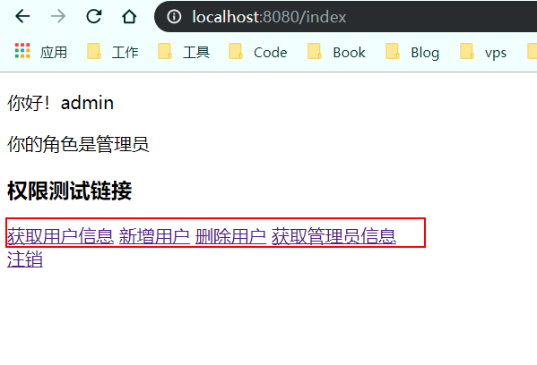
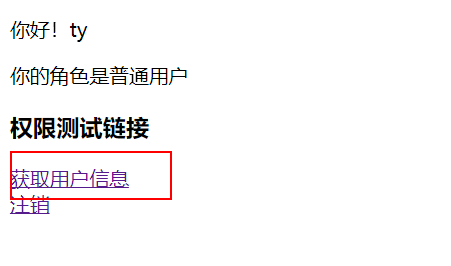

# SpringBoot整合Shiro-Thyeleaf-Tag-使用Thyeleaf标签

## 问题

紧接上一篇教程SpringBoot整合Shiro-RedisCache-缓存。

在shiro权限控制中我们没有权限的处理是跳转403页面，但是一般是只给他显示她所拥有的URL资源。在Thymeleaf中使用shiro标签需要引入第三方jar包，https://github.com/theborakompanioni/thymeleaf-extras-shiro。

## 使用Thymeleaf-Tag

### 添加依赖

```xml
        <!--shiro-thymeleaf-tag-->
        <dependency>
            <groupId>com.github.theborakompanioni</groupId>
            <artifactId>thymeleaf-extras-shiro</artifactId>
            <version>2.0.0</version>
        </dependency>
```

### 修改ShiroConfig配置

```java
    /**
     * 使用shiro-thymeleaf-tag配置
     * @return
     */
    @Bean
    public ShiroDialect shiroDialect() {
        return new ShiroDialect();
    }
```


### 修改index.html，测试标签使用

```html
<!DOCTYPE html>
<html xmlns:th="http://www.thymeleaf.org"
      xmlns:shiro="http://www.pollix.at/thymeleaf/shiro">
<head>
    <meta charset="UTF-8">
    <title>首页</title>
</head>
<body>
<p>你好！[[${user.username}]]</p>
<p shiro:hasRole="admin">你的角色是管理员</p>
<p shiro:hasRole="user">你的角色是普通用户</p>
<h3>权限测试链接</h3>
<div>
    <a shiro:hasPermission="user:get" th:href="@{/user/get}">获取用户信息</a>
    <a shiro:hasPermission="user:post" th:href="@{/user/add}">新增用户</a>
    <a shiro:hasPermission="user:delete" th:href="@{/user/delete}">删除用户</a>
    <a shiro:hasPermission="admin:get" th:href="@{/admin/get}">获取管理员信息</a>
    <a shiro:hasPermission="admin:delete" th:href="@{/admin/delete}">删除管理员</a>

</div>
<a th:href="@{/logout}">注销</a>
</body>
</html>
```

> 注意

在html标签内需要加上`xmlns:shiro="http://www.pollix.at/thymeleaf/shiro"`，否则不能生效。

### 测试功能

#### 启动项目登录管理员用户



发现此时角色是管理员，并且管理员没有删除管理员的权限所以没有显示。

#### 注销后登录普通用户角色



发现此时登录的角色是普通用户，并且普通用户只有获取用户信息的权限。

### 其他标签

## 更多标签

可以查看[JSP / GSP Tag Library Section](http://shiro.apache.org/web.html#Web-JSP%2FGSPTagLibrary) 

```html
guest标签：验证当前用户是否为“访客”，即未认证（包含未记住）的用户；
 	shiro标签：<shiro:guest></shiro:guest>;freemark中： <@shiro.guest> </@shiro.guest> 
user标签：认证通过或已记住的用户 
 	shiro标签：<shiro:user> </shiro:user>  ；freemark中： <@shiro.user> </@shiro.user> 
authenticated标签：已认证通过的用户。不包含已记住的用户，这是与user标签的区别所在。 
	shiro标签：<shiro:authenticated> </shiro:authenticated>；freemark中： <@shiro.authenticated></@shiro.authenticated>
notAuthenticated标签：未认证通过的用户。与authenticated标签相对。 
	shiro标签：<shiro:notAuthenticated> </shiro:notAuthenticated>;freemark中： <@shiro.notAuthenticated></@shiro.notAuthenticated>
principal标签：输出当前用户信息，通常为登录帐号信息  
	shiro标签：Hello,  <@shiro.principal property="name" />  ；freemarker中：  Hello,  <@shiro.principal property="name" />, how are you today?     
hasRole标签：验证当前用户是否属于该角色
	shiro标签： <shiro:hasRole name="administrator">  Administer the system </shiro:hasRole> ；freemarker中：<@shiro.hasRole name=”admin”>Hello admin!</@shiro.hasRole> 
hasAnyRoles标签：验证当前用户是否属于这些角色中的任何一个，角色之间逗号分隔
	shiro标签： <shiro:hasAnyRoles name="admin,user,operator">  Administer the system </shiro:hasAnyRoles> ；freemarker中：<@shiro.hasAnyRoles name="admin,user,operator">Hello admin!</@shiro.hasAnyRoles>
hasPermission标签：验证当前用户是否拥有该权限 ，
	shiro标签： <shiro:hasPermission name="/order:*">  订单 </shiro:hasPermission> ；freemarker中：<@shiro.hasPermission name="/order:*">订单/@shiro.hasPermission> 
lacksRole标签：验证当前用户不属于该角色，与hasRole标签想反，
	shiro标签： <shiro:hasRole name="admin">  Administer the system </shiro:hasRole> ；freemarker中：<@shiro.hasRole name="admin">Hello admin!</@shiro.hasRole> 
lacksPermission标签：验证当前用户不拥有某种权限，与hasPermission标签是相对的，
	shiro标签： <shiro:lacksPermission name="/order:*"> trade </shiro:lacksPermission> ；freemarker中：<@shiro.lacksPermission name="/order:*">trade</@shiro.lacksPermission> 
```


#### Attribute

```html
<p shiro:anyTag>  Goodbye cruel World!</p>
```

#### Element

```html
<shiro:anyTag>  <p>Hello World!</p></shiro:anyTag>
```

#### The `guest` tag

```html
<p shiro:guest="">  Please <a href="login.html">Login</a></p>
```

#### The `user` tag

```html
<p shiro:user="">  Welcome back John! Not John? Click <a href="login.html">here<a> to login.</p>
```

#### The `authenticated` tag

```html
<a shiro:authenticated="" href="updateAccount.html">Update your contact information</a>
```

#### The `notAuthenticated` tag

```html
<p shiro:notAuthenticated="">  Please <a href="login.html">login</a> in order to update your credit card information.</p>
```

#### The `principal` tag

```html
<p>Hello, <span shiro:principal=""></span>, how are you today?</p>
```

or

```html
<p>Hello, <shiro:principal/>, how are you today?</p>
```


Typed principal and principal property are also supported.

#### The `hasRole` tag

```html
<a shiro:hasRole="admin" href="admin.html">Administer the system</a>
```

#### The `lacksRole` tag

```html
<p shiro:lacksRole="administrator">  Sorry, you are not allowed to administer the system.</p>
```

#### The `hasAllRoles` tag

```html
<p shiro:hasAllRoles="developer, project manager">  You are a developer and a project manager.</p>
```

#### The `hasAnyRoles` tag

```html
<p shiro:hasAnyRoles="developer, project manager, administrator">  You are a developer, project manager, or administrator.</p>
```

#### The `hasPermission` tag

```html
<a shiro:hasPermission="user:create" href="createUser.html">Create a new User</a>
```

#### The `lacksPermission` tag

```html
<p shiro:lacksPermission="user:delete">  Sorry, you are not allowed to delete user accounts.</p>
```

#### The `hasAllPermissions` tag

```html
<p shiro:hasAllPermissions="user:create, user:delete">  You can create and delete users.</p>
```

#### The `hasAnyPermissions` tag

```html
<p shiro:hasAnyPermissions="user:create, user:delete">  You can create or delete users.</p>
```

## 使用freemarker模板引擎时使用shiro标签

### 添加依赖

```xml
<!-- shiro-freemarker-tags -->
		<dependency>
		    <groupId>net.mingsoft</groupId>
		    <artifactId>shiro-freemarker-tags</artifactId>
		    <version>1.0.0</version>
		</dependency>
```

### 写配置类

```java
/**
 * 集成Shiro标签
 */
@Component
public class ShiroTagFreeMarkerConfigurer implements InitializingBean {
 
	@Autowired
	private Configuration configuration;
 
	@Autowired
	private FreeMarkerViewResolver resolver;
 
	@Override
	public void afterPropertiesSet() throws Exception {
		// 加上这句后，可以在页面上使用shiro标签
		configuration.setSharedVariable("shiro", new ShiroTags());
		// 加上这句后，可以在页面上用${context.contextPath}获取contextPath
		resolver.setRequestContextAttribute("context");
	}
}
```

### 标签种类

```java
public class ShiroTags extends SimpleHash {
    public ShiroTags() {
        put("authenticated", new AuthenticatedTag());
        put("guest", new GuestTag());
        put("hasAnyRoles", new HasAnyRolesTag());
        put("hasPermission", new HasPermissionTag());
        put("hasRole", new HasRoleTag());
        put("lacksPermission", new LacksPermissionTag());
        put("lacksRole", new LacksRoleTag());
        put("notAuthenticated", new NotAuthenticatedTag());
        put("principal", new PrincipalTag());
        put("user", new UserTag());
    }
}
```

### 自定义Shiro标签

#### 自定义类CustomShiroTags继承ShiroTags

```java
/**
 * 自定义shiro-freemarker标签
 * @author zty
 *
 */
public class CustomShiroTags extends ShiroTags {
	
	public CustomShiroTags() {
        super();
        put("hasAnyPermission", new HasAnyPermissionTag());
    }
}
```

#### 自定义类HasAnyPermissionTag

```java
/**
 * 自定义shiro-freemarker标签
 * @author zty
 *
 */
public class CustomShiroTags extends ShiroTags {
	
	public CustomShiroTags() {
        super();
        put("hasAnyPermission", new HasAnyPermissionTag());
    }
}

自定义类HasAnyPermissionTag

/**
 * 根据传入字符串集合(,分割)是否有任意一个权限,有就返回true
 * @author zty
 *
 */
public class HasAnyPermissionTag extends PermissionTag {
	//返回布尔值确认是否有 权限集合中 任意一个
	@Override
	protected boolean showTagBody(String ps) {
		return isAnyPermitted(ps);
	}
	
	/**
	 * ,分割字符串ps 得到每个字符 调用isPermitted验证,有一个返回true,结果为true
	 * @param ps
	 * @return
	 */
	protected boolean isAnyPermitted(String ps) {
		String[] pArr = ps.split(",");
		for (String p : pArr) {
			if(super.isPermitted(p)) {
				return true;
			}
		}
		return false;
	}

}

```

