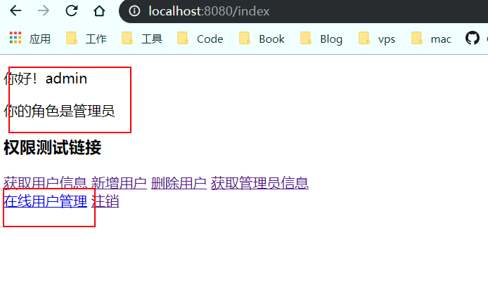
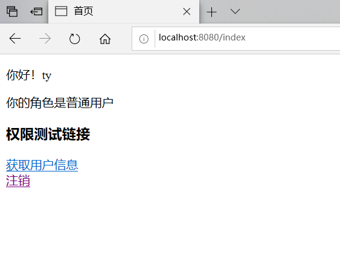
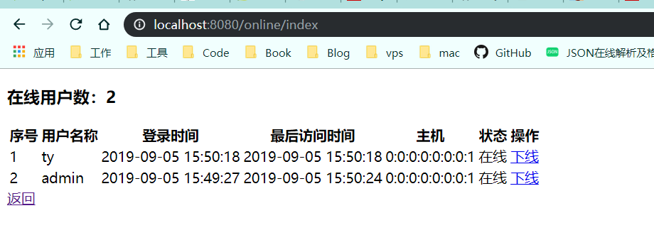
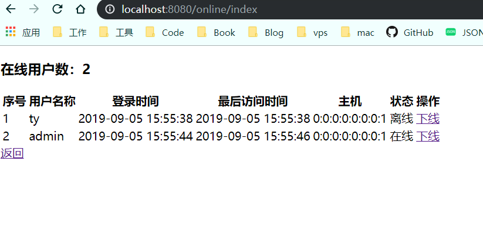

# SpringBoot整合Shiro-Session-使用会话

紧接上一篇教程SpringBoot整合Shiro-Thymeleaf-Tag。

这里我们使用会话管理，使用EhCache实现。

Shiro提供了完整的企业级会话管理功能，不依赖于底层容器（如Tomcat），不管是J2SE还是J2EE环境都可以使用，提供了会话管理，会话事件监听，会话存储/持久化，容器无关的集群，失效/过期支持，对Web的透明支持，SSO单点登录的支持等特性。即直接使用 Shiro 的会话管理可以直接替换如 Web 容器的会话管理。

## shiro中的session特性

- 基于POJO/J2SE：shiro中session相关的类都是基于接口实现的简单的java对象（POJO），兼容所有java对象的配置方式，扩展也更方便，完全可以定制自己的会话管理功能 。
- 简单灵活的会话存储/持久化：因为shiro中的session对象是基于简单的java对象的，所以你可以将session存储在任何地方，例如，文件，各种数据库，内存中等。
- 容器无关的集群功能：shiro中的session可以很容易的集成第三方的缓存产品完成集群的功能。例如，Ehcache + Terracotta, Coherence, GigaSpaces等。你可以很容易的实现会话集群而无需关注底层的容器实现。
- 异构客户端的访问：可以实现web中的session和非web项目中的session共享。
  会话事件监听：提供对对session整个生命周期的监听。
- 保存主机地址：在会话开始session会存用户的ip地址和主机名，以此可以判断用户的位置。
- 会话失效/过期的支持：用户长时间处于不活跃状态可以使会话过期，调用touch()方法，可以主动更新最后访问时间，让会话处于活跃状态。
- 透明的Web支持：shiro全面支持Servlet 2.5中的session规范。这意味着你可以将你现有的web程序改为shiro会话，而无需修改代码。
- 单点登录的支持：shiro session基于普通java对象，使得它更容易存储和共享，可以实现跨应用程序共享。可以根据共享的会话，来保证认证状态到另一个程序。从而实现单点登录。

## 会话相关API

- Subject subject = SecurityUtils.getSubject();
- Session session = subject.getSession();

与web中的 HttpServletRequest.getSession(boolean create) 类似! 
Subject.getSession(true)。即如果当前没有创建session对象会创建一个； 
Subject.getSession(false)，如果当前没有创建session对象则返回null

| **返回值**   | **方法名**                             | **描述**                               |
| ------------ | -------------------------------------- | -------------------------------------- |
| Object       | getAttribute(Object key)               | 根据key标识返回绑定到session的对象     |
| Collection   | getAttributeKeys()                     | 获取在session中存储的所有的key         |
| String       | getHost()                              | 获取当前主机ip地址，如果未知，返回null |
| Serializable | getId()                                | 获取session的唯一id                    |
| Date         | getLastAccessTime()                    | 获取最后的访问时间                     |
| Date         | getStartTimestamp()                    | 获取session的启动时间                  |
| long         | getTimeout()                           | 获取session失效时间，单位毫秒          |
| void         | setTimeout(long maxIdleTimeInMillis)   | 设置session的失效时间                  |
| Object       | removeAttribute(Object key)            | 通过key移除session中绑定的对象         |
| void         | setAttribute(Object key, Object value) | 设置session会话属性                    |
| void         | stop()                                 | 销毁会话                               |
| void         | touch()                                | 更新会话最后访问时间                   |

## 会话管理

对于会话管理,shiro提供了三个默认实现:

- `DefaultSessionManager`: 默认实现,用于se环境

- `ServletContainerSessionManager`: DefaultWebSercurityManager使用的默认实现,用于web环境,直接使用servlet容器的会话

- `DefaultWebSessionManager`：用于web环境的实现,可以替代servletContainerSessionManager,自己维护会话,废弃了servlet容器的会话管理

Session start(SessionContext context); //启动会话 
Session getSession(SessionKey key) throws SessionException;//根据会话Key获取会话 
另外用于Web环境的WebSessionManager又提供了如下接口： 
boolean isServletContainerSessions();//是否使用Servlet容器的会话 
Shiro还提供了ValidatingSessionManager用于验资并过期会话： 
void validateSessions();//验证所有会话是否过期

在Shiro中我们可以通过`org.apache.shiro.session.mgt.eis.SessionDAO`对象的`getActiveSessions()`方法方便的获取到当前所有有效的Session对象。通过这些Session对象，我们可以实现一些的功能，比如查看当前系统的在线人数，查看这些在线用户的一些基本信息，强制让某个用户下线等。

为了实现这些功能，我们在现有的Spring Boot Shiro项目基础上进行一些改造（缓存使用Ehcache）。


## 使用Session管理

### 配置shiroSession监听器

```java
/**
 * @ClassName: ShiroSessionListener
 * @Description: 配置session监听器
 * @author zhangtainyi
 * @date 2019/9/5 14:10
 *
 */
public class ShiroSessionListener implements SessionListener {

    /**
     * 统计在线人数
     * juc包下线程安全自增
     */
    private final AtomicInteger sessionCount = new AtomicInteger(0);

    /**
     * 获取在线人数
     * @return
     */
    public AtomicInteger getSessionCount(){
        return sessionCount;
    }

    /**
     * 会话创建时候触发
     * @param session
     */
    @Override
    public void onStart(Session session) {
        sessionCount.incrementAndGet();//会话创建，在线人数自增
    }

    /**
     * 会话停止时候触发
     * @param session
     */
    @Override
    public void onStop(Session session) {
        sessionCount.decrementAndGet();//会话退出，在线人数自减
    }

    /**
     * 会话过期触发
     * @param session
     */
    @Override
    public void onExpiration(Session session) {
        sessionCount.decrementAndGet();//会话过期，在线人数自减
    }
}

```

### 修改ShiroConfig配置

#### 在ShiroConfig中使用SessionDao

```java
    /**
     * 配置session监听
     * @return
     */
    @Bean("sessionListener")
    public ShiroSessionListener sessionListener(){
        ShiroSessionListener sessionListener = new ShiroSessionListener();
        return sessionListener;
    }

    /**
     * SessionDAO的作用是为Session提供CRUD并进行持久化的一个shiro组件
     * MemorySessionDAO 直接在内存中进行会话维护
     * @return
     */
    @Bean
    public SessionDAO sessionDAO() {
        MemorySessionDAO memorySessionDAO = new MemorySessionDAO();
        return memorySessionDAO;
    }
```

#### 不使用ehcache，使用redis，使用RedisSessionDAO

```java
@Bean
public RedisSessionDAO sessionDAO() {
    RedisSessionDAO redisSessionDAO = new RedisSessionDAO();
    redisSessionDAO.setRedisManager(redisManager());
    return redisSessionDAO;
}
```

#### 将SessionDao注入到SessionManager中

```java
    /**
     * session管理器，将sessiondao注入到session管理器
     * @return
     */
    @Bean
    public SessionManager sessionManager() {
        DefaultWebSessionManager sessionManager = new DefaultWebSessionManager();
        Collection<SessionListener> listeners = new ArrayList<SessionListener>();
        listeners.add(new ShiroSessionListener());
        sessionManager.setSessionListeners(listeners);
        sessionManager.setSessionDAO(sessionDAO());
        return sessionManager;
    }
```

#### 将sessionManager注入到securityManager

```java
    /**
     * 注入自定义realm、EhCacheManager/ReidsCacheManager对象、注入SessionManager
     * @return SecurityManager
     */
    @Bean
    public DefaultWebSecurityManager securityManager(){
        DefaultWebSecurityManager securityManager = new DefaultWebSecurityManager();
        securityManager.setRealm(customRealm());//注入自定义Realm
        securityManager.setRememberMeManager(cookieRememberMeManager());//注入RememberMeManager
        securityManager.setCacheManager(reidsCacheManager());//注入RedisCacheManager
        securityManager.setSessionManager(sessionManager());//注入SessionManager
        return securityManager;
    }
```

### 新建一个实体描述在线用户的信息

```java
public class UserOnline implements Serializable{
	
    private static final long serialVersionUID = 3828664348416633856L;
    // session id
    private String id;
    // 用户id
    private String userId;
    // 用户名称
    private String username;
    // 用户主机地址
    private String host;
    // 用户登录时系统IP
    private String systemHost;
    // 状态
    private String status;
    // session创建时间
    private Date startTimestamp;
    // session最后访问时间
    private Date lastAccessTime;
    // 超时时间
    private Long timeout;
    // get set略
}
```

### 新建Service实现

```java
/**
 * @ClassName: SessionService
 * @Description: 实现查询所有在线用户，提出用户功能
 * @author zhangtainyi
 * @date 2019/9/5 15:00
 *
 */
@Service
public class SessionService {
    @Autowired
    private SessionDAO sessionDAO;

    /**
     * 查询所有用户
     * @return
     */
    public List<UserOnline> list() {
        List<UserOnline> list = new ArrayList<>();
        Collection<Session> sessions = sessionDAO.getActiveSessions();
        for (Session session : sessions) {
            UserOnline userOnline = new UserOnline();
            User user = new User();
            SimplePrincipalCollection principalCollection = new SimplePrincipalCollection();
            if (session.getAttribute(DefaultSubjectContext.PRINCIPALS_SESSION_KEY) == null) {
                continue;
            } else {
                principalCollection = (SimplePrincipalCollection) session
                        .getAttribute(DefaultSubjectContext.PRINCIPALS_SESSION_KEY);
                user = (User) principalCollection.getPrimaryPrincipal();
                userOnline.setUsername(user.getUsername());
                userOnline.setUserId(String.valueOf(user.getId()));
            }
            userOnline.setId((String) session.getId());
            userOnline.setHost(session.getHost());
            userOnline.setStartTimestamp(session.getStartTimestamp());
            userOnline.setLastAccessTime(session.getLastAccessTime());
            Long timeout = session.getTimeout();
            if (timeout == 0l) {
                userOnline.setStatus("离线");
            } else {
                userOnline.setStatus("在线");
            }
            userOnline.setTimeout(timeout);
            list.add(userOnline);
        }
        return list;
    }

    /**
     * 踢出
     * @param sessionId
     * @return
     */
    public boolean forceLogout(String sessionId) {
        Session session = sessionDAO.readSession(sessionId);
        session.setTimeout(0);
        return true;
    }
}
```

通过SessionDao的`getActiveSessions()`方法，我们可以获取所有有效的Session，通过该Session，我们还可以获取到当前用户的Principal信息。

值得说明的是，当某个用户被踢出后（Session Time置为0），该Session并不会立刻从ActiveSessions中剔除，所以我们可以通过其timeout信息来判断该用户在线与否。

如果使用的Redis作为缓存实现，那么，`forceLogout()`方法需要稍作修改：

```java
@Override
public boolean forceLogout(String sessionId) {
    Session session = sessionDAO.readSession(sessionId);
    sessionDAO.delete(session);
    return true;
}
```

### 新建Controller

```java
@Controller
@RequestMapping("/online")
public class SessionController {
    @Autowired
    SessionService sessionService;

    @RequestMapping("index")
    public String online() {
        return "online";
    }

    @ResponseBody
    @RequestMapping("list")
    public List<UserOnline> list() {
        return sessionService.list();
    }

    @ResponseBody
    @RequestMapping("forceLogout")
    public ResponseData forceLogout(String id) {
        try {
            sessionService.forceLogout(id);
            return ResponseUtil.success();
        } catch (Exception e) {
            e.printStackTrace();
            return ResponseUtil.failure(500,"踢出用户失败");
        }
    }
}
```

### 修改html

#### 新建一个online.html用于显示在线用户信息

```html
<!DOCTYPE html>
<html xmlns:th="http://www.thymeleaf.org">
<head>
    <meta charset="UTF-8">
    <title>在线用户管理</title>

</head>
<body>
<h3>在线用户数：<span id="onlineCount"></span></h3>
<table>
    <tr>
        <th>序号</th>
        <th>用户名称</th>
        <th>登录时间</th>
        <th>最后访问时间</th>
        <th>主机</th>
        <th>状态</th>
        <th>操作</th>
    </tr>
</table>
<a th:href="@{/index}">返回</a>
</body>
<script th:src="@{/js/dateFormat.js}"></script>
<!-- jQuery (Bootstrap 的所有 JavaScript 插件都依赖 jQuery，所以必须放在前边) -->
<script src="https://cdn.jsdelivr.net/npm/jquery@1.12.4/dist/jquery.min.js"></script>
<!-- 加载 Bootstrap 的所有 JavaScript 插件。你也可以根据需要只加载单个插件。 -->
<script src="https://cdn.jsdelivr.net/npm/bootstrap@3.3.7/dist/js/bootstrap.min.js"></script>
<script th:inline="javascript">
    $.get("/online/list", {}, function(r){
        var length = r.length;
        $("#onlineCount").text(length);
        var html = "";
        for(var i = 0; i < length; i++){
            html += "<tr>"
                + "<td>" + (i+1) + "</td>"
                + "<td>" + r[i].username + "</td>"
                + "<td>" + new Date(r[i].startTimestamp).Format("yyyy-MM-dd hh:mm:ss") + "</td>"
                + "<td>" + new Date(r[i].lastAccessTime).Format("yyyy-MM-dd hh:mm:ss") + "</td>"
                + "<td>" + r[i].host + "</td>"
                + "<td>" + r[i].status + "</td>"
                + "<td><a href='#' onclick='offline(\"" + r[i].id + "\",\"" + r[i].status +"\")'>下线</a></td>"
                + "</tr>";
        }
        $("table").append(html);
    },"json");

    function offline(id,status){
        if(status == "离线"){
            alert("该用户已是离线状态！！");
            return;
        }
        $.get("/online/forceLogout", {"id": id}, function(r){
            if (r.code == 200) {
                alert('该用户已强制下线！');
                location.href = '/online/index';
            } else {
                alert(r.msg);
            }
        },"json");
    }
</script>
</html>
```

#### 修改index.html，添加超链接

```html
<!DOCTYPE html>
<html xmlns:th="http://www.thymeleaf.org"
      xmlns:shiro="http://www.pollix.at/thymeleaf/shiro">
<head>
    <meta charset="UTF-8">
    <title>首页</title>
</head>
<body>
<p>你好！[[${user.username}]]</p>
<p shiro:hasRole="admin">你的角色是管理员</p>
<p shiro:hasRole="user">你的角色是普通用户</p>
<h3>权限测试链接</h3>
<div>
    <a shiro:hasPermission="user:get" th:href="@{/user/get}">获取用户信息</a>
    <a shiro:hasPermission="user:post" th:href="@{/user/add}">新增用户</a>
    <a shiro:hasPermission="user:delete" th:href="@{/user/delete}">删除用户</a>
    <a shiro:hasPermission="admin:get" th:href="@{/admin/get}">获取管理员信息</a>
    <a shiro:hasPermission="admin:delete" th:href="@{/admin/delete}">删除管理员</a>

</div>
<a shiro:hasRole="admin" th:href="@{/online/index}">在线用户管理</a>
<a th:href="@{/logout}">注销</a>
</body>
</html>
```


### 测试功能

#### 启动项目在谷歌浏览器登录admin



此时admin拥有在线用户管理的权限

#### 在edge浏览器登录ty用户



发现此时登录的角色是普通用户，并且普通用户只有获取用户信息的权限。并没有在线用户管理的权限。

#### admin用户点击在线用户管理URL



#### 对用户ty点击下线操作，状态刷新



