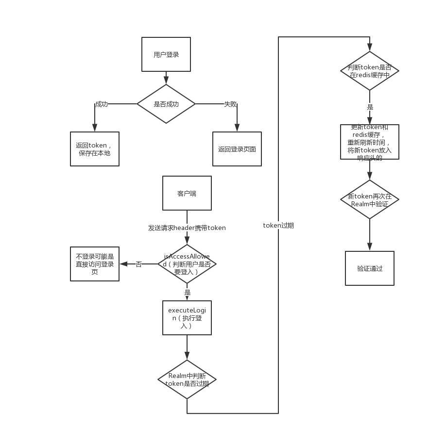

# SpringBoot整合Shiro-JWT-使用Token过期刷新

这里使用SpringBoot-Shiro-RedisCache为基板，添加JWT和token过期刷新。

JWT（JSON Web Tokens）是一种用于安全的传递信息而采用的一种标准。Web系统中，我们使用加密的Json来生成Token在服务端与客户端无状态传输，代替了之前常用的Session。
系统采用Redis作为缓存，解决Token过期更新的问题，同时集成SSO登录，完整过程这里来总结一下。

## 业务要求

半个月内免登陆，这里就要使用到了refreshToken了，jwt设计思想很到位：设置发给前端的token一个有效期，比如2个小时，2个小时候前端发来的token就会失效，这个时候我们根据发来的token判断下，如果这个token在2个小时外，并在刷新token的有效期内（比如半个月内），那么我们在给前端返回数据的时候返回一个新token，前端接到这个token存储起来，当再次请求的时候，发送新的token，如此周而复始，只要你在半个月内没有间断去进入系统，那么完全不需要去进行登录的操作。

## JWT登录主要流程

1. 登录时，密码验证通过，取当前时间戳生成签名Token，放在Response Header的Authorization属性中，同时在缓存中记录值为当前时间戳的RefreshToken，并设置有效期。
2. 客户端请求每次携带Token进行请求。
3. 服务端每次校验请求的Token有效后，同时比对Token中的时间戳与缓存中的RefreshToken时间戳是否一致，一致则判定Token有效。
4. 当请求的Token被验证时抛出`TokenExpiredException`异常时说明Token过期，校验时间戳一致后重新生成Token并调用登录方法。
5. 每次生成新的Token后，同时要根据新的时间戳更新缓存中的RefreshToken，以保证两者时间戳一致。

## 添加依赖

只写几个关键依赖，其他的参考pom文件

```xml
        <!--jwt-->
        <dependency>
            <groupId>com.auth0</groupId>
            <artifactId>java-jwt</artifactId>
            <version>RELEASE</version>
        </dependency>
        <!--配置shiro-redis-->
        <dependency>
            <groupId>org.crazycake</groupId>
            <artifactId>shiro-redis</artifactId>
            <version>3.2.3</version>
        </dependency>
```

## Jedis配置

使用jedis操作redis，需要做一些配置并写一个工具类操作jedis。

由于shiro-redis已经实现了shiro和redis的整合，要使用其中的jedis需要自定义一个properties文件对jedis做一些配置，包括redis配置和jedisPoool配置。

### redis.properties

```properties
# Redis数据库索引（默认为0）
spring.redis.database = 0
# Redis服务器地址
spring.redis.host = localhost
# Redis服务器连接端口
spring.redis.port = 6379
# Redis连接超时时间
spring.redis.timeout = 10000
# 连接池最大连接数（使用负值表示没有限制）
spring.redis.jedis.pool.maxActive = 5000
# 连接池最大阻塞等待时间（使用负值表示没有限制）
spring.redis.jedis.pool.maxWait = 10000
# 连接池中的最大空闲连接
spring.redis.jedis.pool.maxIdle = 5000
# 连接池中的最小空闲连接
spring.redis.jedis.pool.minIdle = 0
```


### JedisConfig

`redis.properties`配置注入JedisConfig配置类，并初始化一个`jedisPool`注入SpringBean管理。

```java
@Configuration
@PropertySource("classpath:properties/redis.properties")
public class JedisConfig {

    @Value("${spring.redis.database}")
    private String database;
    @Value("${spring.redis.host}")
    private String host;
    @Value("${spring.redis.port}")
    private Integer port;
    @Value("${spring.redis.timeout}")
    private Integer timeout;
    @Value("${spring.redis.jedis.pool.maxActive}")
    private Integer maxActive;
    @Value("${spring.redis.jedis.pool.maxWait}")
    private Integer maxWait;
    @Value("${spring.redis.jedis.pool.maxIdle}")
    private Integer maxIdle;
    @Value("${spring.redis.jedis.pool.minIdle}")
    private Integer minIdle;

    /**
     * 配置JedisPool
     * @return
     */
    @Bean
    public JedisPool jedisPool(){
        JedisPoolConfig config = new JedisPoolConfig();
        config.setMaxIdle(maxIdle);
        config.setMaxTotal(maxActive);
        config.setMaxWaitMillis(maxWait);
        config.setMinIdle(minIdle);
        JedisPool jedisPool = new JedisPool(config,host,port,timeout);
        return jedisPool;
    }
}

```

### JedisUtil

写一个jedis工具类，封装jedis部分操作。

```java
/**
 * redis工具类
 * 一些jedis操作方法
 */
@Component
public class JedisUtil {

    //通过jedis连接池获取redis连接
    @Resource
    private JedisPool jedisPool;

    //获取连接
    private Jedis getResource(){
        return jedisPool.getResource();
    }

    public byte[] set(byte[] key, byte[] value) {

        try (Jedis jedis = getResource()){
            jedis.set(key,value);
            return value;
        }
    }

    public int expire(byte[] key, int i) {
        try (Jedis jedis = getResource()){
            jedis.expire(key,i);
            return i;
        }
    }

    public byte[] get(byte[] key) {
        try (Jedis jedis = getResource()){
            return jedis.get(key);
        }
    }

    public void del(byte[] key) {
        try (Jedis jedis = getResource()){
            jedis.del(key);
        }
    }

    public Set<byte[]> keys(String pattern) {
        try (Jedis jedis = getResource()){
            return jedis.keys((pattern + "*").getBytes());
        }
    }

    public Set<byte[]> values(String pattern) {
        try (Jedis jedis = getResource()){
            Set<String> keys = jedis.keys(pattern + "*");
            Set<byte[]> values = new HashSet<>();
            for (String key : keys) {
                values.add(jedis.get(key).getBytes());
            }
            return values;
        }
    }
}

```


## JWT 配置

注意类在包里面的层级关系，springboot加载时会闲加载深层包的bean。所以jwt包应该放在shiro包下，因为shiroConfig需要用到jwt包中的bean。也可以使用注解`@DependsOn({"jwtProperties","jedisConfig"})//在JwtProperties后加载`。

### jwt.properties文件

配置jwt的缓存刷新时间，shiro缓存刷新时间等。

```properties
#  token过期时间，单位分钟
token.tokenExpireTime=120

#  RefreshToken过期时间，单位：分钟, 24*60=1440
token.refreshTokenExpireTime=1440

#  shiro缓存有效期，单位分钟,2*60=120
token.shiroCacheExpireTime=120

#  token加密密钥
token.secretKey=jwt
```

### JwtUtil工具类

将`jwt.properties`的内容注入到JwtConfig类。

```java
@PropertySource("classpath:properties/jwt.properties")
@ConfigurationProperties(prefix = "token")
@Configuration
public class JwtConfig {
    //token过期时间，单位分钟
//    @Value("${token.tokenExpireTime}")
    private Integer tokenExpireTime;
    
    //刷新Token过期时间，单位分钟
//    @Value("${token.refreshTokenExpireTime}")
    private Integer refreshTokenExpireTime;
    
    //Shiro缓存有效期，单位分钟
//    @Value("${token.shiroCacheExpireTime}")
    private Integer shiroCacheExpireTime;
    
    //token加密密钥
//    @Value("${token.secretKey}")
    private String secretKey;


    public Integer getTokenExpireTime() {
        return tokenExpireTime;
    }

    public void setTokenExpireTime(Integer tokenExpireTime) {
        this.tokenExpireTime = tokenExpireTime;
    }

    public Integer getRefreshTokenExpireTime() {
        return refreshTokenExpireTime;
    }

    public void setRefreshTokenExpireTime(Integer refreshTokenExpireTime) {
        this.refreshTokenExpireTime = refreshTokenExpireTime;
    }

    public Integer getShiroCacheExpireTime() {
        return shiroCacheExpireTime;
    }

    public void setShiroCacheExpireTime(Integer shiroCacheExpireTime) {
        this.shiroCacheExpireTime = shiroCacheExpireTime;
    }

    public String getSecretKey() {
        return secretKey;
    }

    public void setSecretKey(String secretKey) {
        this.secretKey = secretKey;
    }
}
```


### JwtToken实体

JWTToken实现AuthenticationToken

```java
public class JWTToken implements AuthenticationToken {

    private String token;

    private String exipreAt;

    public JWTToken() {
    }

    public JWTToken(String token) {
        this(token,null);
    }

    public JWTToken(String token, String exipreAt) {
        this.token = token;
        this.exipreAt = exipreAt;
    }

    @Override
    public Object getPrincipal() {
        return token;
    }

    @Override
    public Object getCredentials() {
        return token;
    }
    //get/set省略
}

```

### JwtRedisCache

操作jwt的redis缓存的类。

```java
@Component
public class JwtRedisCache<K,V> implements Cache<K,V> {

    @Resource
    private JedisUtil jedisUtil;

    private final String CACHE_PREFIX = "jwt:";//定义键前缀
    private final Integer DEFAULT_EXPIRE_TIME = 600;//失效时间默认十分钟

    private byte[] getKey(K k){
        if(k instanceof String){
            return (CACHE_PREFIX + k).getBytes();
        }
        return SerializationUtils.serialize(k);
    }

    @Override
    public V get(K k) throws CacheException {
        System.out.println("从redis获取数据");
        byte[]value = jedisUtil.get(getKey(k));
        if(value != null){
            //在redis获取后可以存放在本地缓存中进一步提高性能，减轻redis压力
            return (V) SerializationUtils.deserialize(value);
        }
        return null;
    }

    @Override
    public V put(K k, V v) throws CacheException {
        byte[]key = getKey(k);
        byte[]value = SerializationUtils.serialize(v);
        jedisUtil.set(key,value);
        jedisUtil.expire(key,DEFAULT_EXPIRE_TIME);
        return v;
    }

    /**
     *
     * @param k
     * @param v
     * @param expire 分钟 int 失效时间
     * @return
     * @throws CacheException
     */
    public V put(K k, V v, Integer expire) throws CacheException {
        byte[]key = getKey(k);
        byte[]value = SerializationUtils.serialize(v);
        jedisUtil.set(key,value);
        jedisUtil.expire(key,expire * 60);
        return v;
    }


    @Override
    public V remove(K k) throws CacheException {
        byte[]key = getKey(k);
        byte[]value = jedisUtil.get(key);
        jedisUtil.del(key);
        if(value != null){
            return (V) SerializationUtils.deserialize(value);
        }
        return null;
    }

    @Override
    public void clear() throws CacheException {
        //获取RedisCache所有键
        Set<byte[]> keys = jedisUtil.keys(CACHE_PREFIX);
        if(CollectionUtils.isEmpty(keys)){
            for (byte[] key : keys) {
                jedisUtil.del(key);
            }
        }
    }

    @Override
    public int size() {
        return jedisUtil.keys(CACHE_PREFIX).size();
    }

    @Override
    public Set<K> keys() {
        Set<K> keys = new HashSet<>();
        for (byte[] key : jedisUtil.keys(CACHE_PREFIX)) {
            keys.add((K) SerializationUtils.deserialize(key));
        }
        return keys;
    }

    @Override
    public Collection<V> values() {
        Set<V> values = new HashSet<>();
        for (byte[] value : jedisUtil.values(CACHE_PREFIX)) {
            values.add((V) SerializationUtils.deserialize(value));
        }
        return values;
    }
}
```

### JwtFilter过滤器（核心）

将JwtFilter放置在shiro过滤器链上，进行拦截，对jwt进行校验。

请求进来如果时登录就不拦截，不是登录拦截进行token校验。如果在CustomRealm中抛出token过期异常，则进行token是否要进行刷新的判断`refreshToken()`，如果要进行刷新，就刷新，如果刷新期也过了，就返回401异常。



```java
/**
 *  @ClassName: JwtFilter
 *  @Description: JWT过滤器
 *  @author: zhangtianyi
 *  @Date: 2019-09-04 21:28
 *
 */

public class JwtFilter extends BasicHttpAuthenticationFilter {
    private Logger log = LoggerFactory.getLogger(this.getClass());

    private static final String AUTHORIZATION = "Authorization";

    private AntPathMatcher pathMatcher = new AntPathMatcher();

    private JwtRedisCache jwtRedisCache;

    private JwtConfig jwtConfig;

    public JwtFilter() {
    }

    public JwtFilter(JwtRedisCache jwtRedisCache, JwtConfig jwtConfig) {
        this.jwtRedisCache = jwtRedisCache;
        this.jwtConfig = jwtConfig;
    }

    @Override
    protected boolean isAccessAllowed(ServletRequest request, ServletResponse response,
              Object mappedValue) throws UnauthorizedException {

        //判断请求的请求头是否带上 "Token"
        if (isLoginAttempt(request, response)) {
            //如果存在，则进入 executeLogin 方法执行登入，检查 token 是否正确
            try {
                this.executeLogin(request, response);
            } catch (Exception e) {
                String msg = e.getMessage();
                Throwable throwable = e.getCause();
                if (throwable != null && throwable instanceof SignatureVerificationException) {
                    msg = "Token或者密钥不正确(" + throwable.getMessage() + ")";
                } else if (throwable != null && throwable instanceof TokenExpiredException) {
                    // AccessToken已过期,但在刷新期内，刷新token
                    if (this.refreshToken(request, response)) {
                        return true;
                    } else {
                        msg = "Token已过期(" + throwable.getMessage() + ")";
                    }
                } else {
                    if (throwable != null) {
                        msg = throwable.getMessage();
                    }
                }
                //token 错误
                log.error("认证不通过，请重新登录！");
                this.response401(request,response,msg);
                return false;
            }
        }
        //如果请求头不存在 Token，则可能是执行登陆操作或者是游客状态访问，无需检查 token，直接返回 true
        return true;
    }
    /**
     * 判断用户是否想要登入。
     * 检测 header 里面是否包含 token 字段
     */
    @Override
    protected boolean isLoginAttempt(ServletRequest request, ServletResponse response) {
        HttpServletRequest req = (HttpServletRequest) request;
        String token = req.getHeader(AUTHORIZATION);
        return token != null;
    }

    /**
     * 执行登录操作
     */
    @Override
    protected boolean executeLogin(ServletRequest request, ServletResponse response) throws Exception {

        HttpServletRequest httpServletRequest = (HttpServletRequest) request;
        String token = httpServletRequest.getHeader(AUTHORIZATION);
        JwtToken jwtToken = new JwtToken(token);

        // 提交给realm进行登入，如果错误他会抛出异常并被捕获
        getSubject(request, response).login(jwtToken);
        // 如果没有抛出异常则代表登入成功，返回true
        return true;

    }

    /**
     * 刷新AccessToken，进行判断RefreshToken是否过期，未过期就返回新的AccessToken且继续正常访问
     */
    private boolean refreshToken(ServletRequest request, ServletResponse response) {
        // 获取Token(Shiro中getAuthzHeader方法已经实现)
        String token = this.getAuthzHeader(request);
        // 获取当前Token的帐号信息
        String username = JwtUtil.getClaim(token, SecurityConsts.USERNAME);
        String refreshTokenCacheKey = SecurityConsts.REFRESH_TOKEN + username;
        // 判断Redis中RefreshToken是否存在
        if (jwtRedisCache.get(refreshTokenCacheKey) != null) {
            // 获取RefreshToken时间戳,及Token中的时间戳
            // 相比如果一致，进行Token刷新
            String currentTimeMillisRedis = (String) jwtRedisCache.get(refreshTokenCacheKey);
            String tokenMillis = JwtUtil.getClaim(token, SecurityConsts.CURRENT_TIME_MILLIS);

            if (tokenMillis.equals(currentTimeMillisRedis)) {

                // 设置RefreshToken中的时间戳为当前最新时间戳
                String currentTimeMillis = String.valueOf(System.currentTimeMillis());
                jwtRedisCache.put(refreshTokenCacheKey, currentTimeMillis, jwtConfig.getRefreshTokenExpireTime());

                // 刷新AccessToken，为当前最新时间戳
                token = JwtUtil.sign(username, currentTimeMillis);

                // 使用AccessToken 再次提交给ShiroRealm进行认证，如果没有抛出异常则登入成功，返回true
                JwtToken jwtToken = new JwtToken(token);
                this.getSubject(request, response).login(jwtToken);

                // 设置响应的Header头新Token
                HttpServletResponse httpServletResponse = (HttpServletResponse) response;
                httpServletResponse.setHeader(SecurityConsts.REQUEST_AUTH_HEADER, token);
                httpServletResponse.setHeader("Access-Control-Expose-Headers", SecurityConsts.REQUEST_AUTH_HEADER);
                return true;
            }
        }
        return false;
    }

    /**
     * 对跨域提供支持
     */
    @Override
    protected boolean preHandle(ServletRequest request, ServletResponse response) throws Exception {
        HttpServletRequest httpServletRequest = (HttpServletRequest) request;
        HttpServletResponse httpServletResponse = (HttpServletResponse) response;
        httpServletResponse.setHeader("Access-control-Allow-Origin", httpServletRequest.getHeader("Origin"));
        httpServletResponse.setHeader("Access-Control-Allow-Methods", "GET,POST,OPTIONS,PUT,DELETE");
        httpServletResponse.setHeader("Access-Control-Allow-Headers", httpServletRequest.getHeader("Access-Control-Request-Headers"));
        // 跨域时会首先发送一个option请求，这里我们给option请求直接返回正常状态
        if (httpServletRequest.getMethod().equals(RequestMethod.OPTIONS.name())) {
            httpServletResponse.setStatus(HttpStatus.OK.value());
            return false;
        }
        return super.preHandle(request, response);
    }

    /**
     * 401非法请求
     * @param req
     * @param resp
     */
    private void response401(ServletRequest req, ServletResponse resp,String msg) {
        HttpServletResponse httpServletResponse = (HttpServletResponse) resp;
        httpServletResponse.setStatus(HttpStatus.UNAUTHORIZED.value());
        httpServletResponse.setCharacterEncoding("UTF-8");
        httpServletResponse.setContentType("application/json; charset=utf-8");
        try (PrintWriter out =httpServletResponse.getWriter()){

            ResponseData result = new ResponseData();
            result.setCode(401);
            result.setMsg(msg);
            out.append(new ObjectMapper().writeValueAsString(result));
        } catch (IOException e) {
            log.error("返回Response信息出现IOException异常:" + e.getMessage());
        }
    }

    /**
     * 将非法请求跳转到 /unauthorized/**
     */
    private void responseError(ServletResponse response, String message) {
        try {
            HttpServletResponse httpServletResponse = (HttpServletResponse) response;
            //设置编码，否则中文字符在重定向时会变为空字符串
            message = URLEncoder.encode(message, "UTF-8");
            httpServletResponse.sendRedirect("/unauthorized/" + message);
        } catch (IOException e) {
            log.error(e.getMessage());
        }
    }
}

```

请求需要经过JWTFilter过滤器，且请求头中`Authorization`都需要携带token，刷新token后，需要将新token传入响应头中的`Authorization`。

### JWTUtil工具类

使用JWTUtil进行验证，签名，解密

```java
@Component
public class JwtUtil {

    @Autowired
    JwtConfig jwtConfig;

    @Autowired
    private static JwtUtil jwtUtil;

    @PostConstruct
    public void init() {
        jwtUtil = this;
        jwtUtil.jwtConfig = this.jwtConfig;
    }

    /**
     * 校验token是否正确
     * @param token 密钥
     * @return 是否正确
     */
    public static boolean verify(String token) {
        try {
            Algorithm algorithm = Algorithm.HMAC256(jwtUtil.jwtConfig.getSecretKey());
            JWTVerifier verifier = JWT.require(algorithm)
                    .build();
            DecodedJWT jwt = verifier.verify(token);
            return true;
        } catch (Exception exception) {
            return false;
        }
    }

    /**
     * 获得token中的私有信息无需secret解密也能获得
     * @return token中包含的用户名
     */
    public static String getUsername(String token) {
        try {
            DecodedJWT jwt = JWT.decode(token);
            return jwt.getClaim(SecurityConsts.USERNAME).asString();
        } catch (JWTDecodeException e) {
            return null;
        }
    }

    /**
     * 获取指定claim
     * @param token
     * @param claimName
     * @return
     */
    public static String getClaim(String token, String claimName){
        return JWT.decode(token).getClaim(claimName).asString();
    }

    /**
     * 生成签名,指定时间后过期
     * @param username 用户名
     * @param currentTimeMillis 时间戳
     * @return token
     */
    public static String sign(String username,  String currentTimeMillis) {
        //过期时间毫秒
        Date date = new Date(System.currentTimeMillis() + jwtUtil.jwtConfig.getTokenExpireTime()*60*1000);
        Algorithm algorithm = Algorithm.HMAC256(jwtUtil.jwtConfig.getSecretKey());
        //创建payload的私有声明（根据特定的业务需要添加，如果要拿这个做验证，一般是需要和jwt的接收方提前沟通好验证方式的）
        return JWT.create()
                .withClaim(SecurityConsts.USERNAME, username)
                .withClaim(SecurityConsts.CURRENT_TIME_MILLIS, currentTimeMillis)
                .withExpiresAt(date)//过期时间
                .sign(algorithm);
    }
}
```


## ShiroConfig

由于使用jwt校验登录，是无状态的，所以不需要RememberMe，所以删除配置。

去掉自定义Realm配置的密码加密，因为之后每次校验jwt。传递自定义的token。

### CustomRealm

用户验证以及权限验证的地方，用户验证多加了一个校验，就是我们当前请求的token中包含的时间戳与缓存中的RefreshToken对比，一致才验证通过。

此处对token进行验证，token验证不通过可能是token已经超时了，此时需要在JwtFilter中进行是否需要刷新的判断，缓存中还有token，就需要刷新token，回传新token进行校验，缓存没有，说明已经过token期限了。

```java
public class CustomRealm extends AuthorizingRealm {

    private Logger log = LoggerFactory.getLogger(this.getClass());
    @Resource
    private JwtRedisCache jwtRedisCache;
    @Resource
    private UserService userService;
    @Resource
    private UserRoleService userRoleService;
    @Resource
    private UserPermsService userPermsService;

    /**
     * 大坑，需要重写这个方法
     */
    @Override
    public boolean supports(AuthenticationToken token) {
        return token instanceof JwtToken;
    }


    /**
     * 登录认证
     */
    @Override
    protected AuthenticationInfo doGetAuthenticationInfo(AuthenticationToken authenticationToken) throws AuthenticationException{
        log.info("-----doGetAuthenticationInfo 开始-----");
        // 这里的 token是从 JwtFilter 的 executeLogin 方法传递过来的
        String token = (String) authenticationToken.getCredentials();
        //1.从token中获取用户名，因为用户名不是私密直接获取
        String usernmae = JwtUtil.getUsername(token);
        //2.通过用户名到数据库中获取角色权限数据
        User user = userService.findByUsername(usernmae);
        if(user == null ){
            throw new AuthenticationException("用户名或密码错误");
        }
        String refreshTokenCacheKey = SecurityConsts.REFRESH_TOKEN + usernmae;

        if (JwtUtil.verify(token)&&jwtRedisCache.get(refreshTokenCacheKey)!=null) {
            String currentTimeMillisRedis = (String) jwtRedisCache.get(refreshTokenCacheKey);
            // 获取AccessToken时间戳，与RefreshToken的时间戳对比
            if (JwtUtil.getClaim(token, SecurityConsts.CURRENT_TIME_MILLIS).equals(currentTimeMillisRedis)) {
                log.info("-----doGetAuthenticationInfo 结束-----");
                return new SimpleAuthenticationInfo(token, token, getName());
            }
        }
        throw new TokenExpiredException("Token expired or incorrect.");
    }
    //获取权限
    @Override
    protected AuthorizationInfo doGetAuthorizationInfo(PrincipalCollection principalCollection) {
        //1.从主体传过来的认证信息中，获取用户对象
        String token = (String)principalCollection.getPrimaryPrincipal();
        User user = userService.findByUsername(JwtUtil.getUsername(token));
        //通过用户名到数据库获取角色和权限
        Set<String> roles = userRoleService.getRoleByUsername(user.getUsername());
        Set<String> permissions = userPermsService.getPermsByusername(user);
        //构造对象返回加上角色权限
        SimpleAuthorizationInfo authorizationInfo = new SimpleAuthorizationInfo();
        authorizationInfo.setRoles(roles);//角色
        authorizationInfo.setStringPermissions(permissions);//权限
        return authorizationInfo;

    }
}

```


### ShiroConfig配置

```java
@Configuration
@DependsOn({"jwtProperties","jedisConfig"})//在JwtProperties后加载
public class ShiroConfig {
    private Logger log = LoggerFactory.getLogger(ShiroConfig.class);

    @Autowired
    private JwtConfig jwtConfig;
    @Autowired
    private JwtRedisCache jwtRedisCache;

    //Shiro缓存有效期，单位分钟
    @Value("${token.shiroCacheExpireTime}")
    private Integer shiroCacheExpireTime;
    /**
     * 将自定义realm让spring管理
     * @return 自定义Realm管理器
     */
    @Bean
    public CustomRealm customRealm(){
        CustomRealm customRealm = new CustomRealm();
        log.info("加载CustomRealm完成...");
        return customRealm;
    }

    /**
     * redis管理器
     * @return
     */
    public RedisManager redisManager() {
        RedisManager redisManager = new RedisManager();
        return redisManager;
    }

    /**
     * redis缓存管理器
     * @return CustomRedisCacheManager
     */
    public RedisCacheManager reidsCacheManager() {
        RedisCacheManager redisCacheManager = new RedisCacheManager();
        redisCacheManager.setRedisManager(redisManager());//注入redis管理器
        redisCacheManager.setExpire(jwtConfig.getShiroCacheExpireTime()*60);//设置过期时间
        return redisCacheManager;
    }


    /**
     * 注入自定义realm、EhCacheManager/ReidsCacheManager对象
     * @return SecurityManager
     */
    @Bean
    public DefaultWebSecurityManager securityManager(){
        DefaultWebSecurityManager securityManager = new DefaultWebSecurityManager();
        securityManager.setRealm(customRealm());//注入自定义Realm
        securityManager.setCacheManager(reidsCacheManager());//注入RedisCacheManager
        return securityManager;
    }


    /**
     * 开启shiro注解
     * @param securityManager
     * @return
     */
    @Bean
    public AuthorizationAttributeSourceAdvisor authorizationAttributeSourceAdvisor(SecurityManager securityManager){
        AuthorizationAttributeSourceAdvisor authorizationAttributeSourceAdvisor = new
                AuthorizationAttributeSourceAdvisor();
        authorizationAttributeSourceAdvisor.setSecurityManager(securityManager);
        return authorizationAttributeSourceAdvisor;
    }

    //配置shiro的web过滤器,是shiro的核心配置,shiro的所有功能都基于这个对象
    @Bean
    public ShiroFilterFactoryBean shiroFilterFactoryBean(SecurityManager securityManager) {
        ShiroFilterFactoryBean shiroFilterFactoryBean = new ShiroFilterFactoryBean();
        shiroFilterFactoryBean.setSecurityManager(securityManager);
        shiroFilterFactoryBean.setLoginUrl("/login");
        shiroFilterFactoryBean.setSuccessUrl("/index");
        shiroFilterFactoryBean.setUnauthorizedUrl("/unauthorized/**");//无权限跳转
        // 在 Shiro过滤器链上加入 JwtFilter
        LinkedHashMap<String, Filter> filters = new LinkedHashMap<>();
        filters.put("jwt", new JwtFilter(jwtRedisCache, jwtConfig));
        shiroFilterFactoryBean.setFilters(filters);

        LinkedHashMap<String, String> filterChainDefinitionMap = new LinkedHashMap<>();
        //放行不需要认证的接口
        filterChainDefinitionMap.put("/logout","logout");
        filterChainDefinitionMap.put("/login","anon");
        filterChainDefinitionMap.put("/unauthorized/**","anon");
        filterChainDefinitionMap.put("/**", "jwt");

        shiroFilterFactoryBean.setFilterChainDefinitionMap(filterChainDefinitionMap);

        return shiroFilterFactoryBean;
    }
}

```

## 其他

其他代码请看源码，源码中还有对ip检测，自行阅读。

## 测试

使用postman进行测试