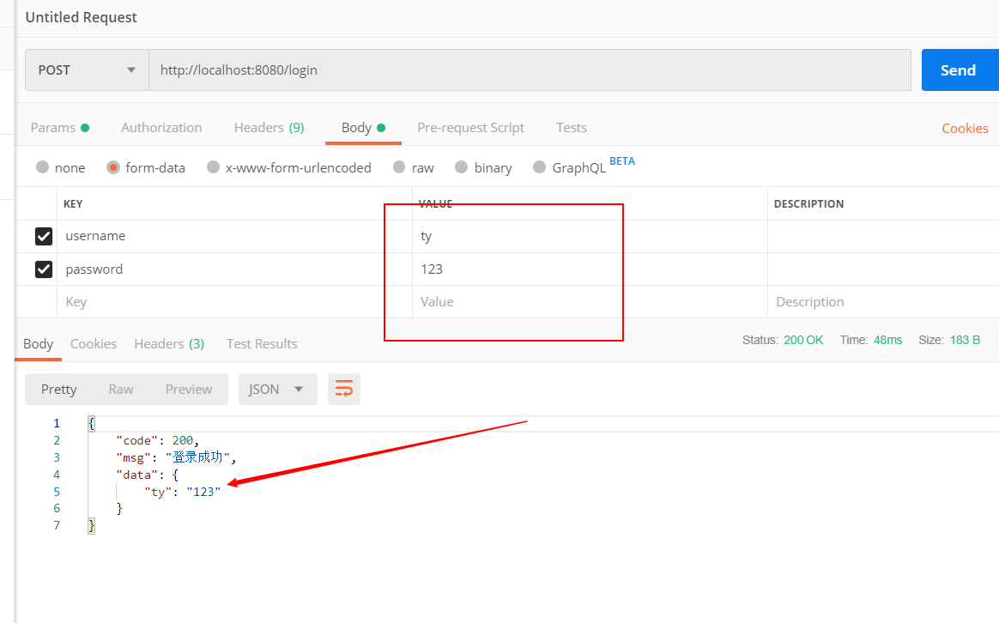
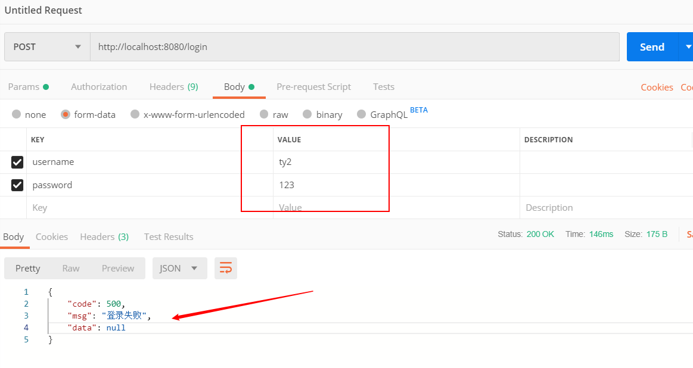

## SpringBoot异常处理

### 1.自定义异常类

```java
public class MyException extends RuntimeException {

    private Integer code;

    public MyException(Integer code, String msg){
        super(msg);
        this.code = code;
    }

    public Integer getCode() {
        return code;
    }

    public void setCode(Integer code) {
        this.code = code;
    }
}
```

Spring中只有RuntimeException可以事务回滚，RuntimeException继承Exception，所以这里继承RuntimeException。

### 2.定义统一格式回传数据

```java
public class ResponseBean {
    private int code;
    private String msg;
    private Object data;

    public ResponseBean() {
    }

    public ResponseBean(int code, String msg, Object data) {
        this.code = code;
        this.msg = msg;
        this.data = data;
    }

    public int getCode() {
        return code;
    }

    public void setCode(int code) {
        this.code = code;
    }

    public String getMsg() {
        return msg;
    }

    public void setMsg(String msg) {
        this.msg = msg;
    }

    public Object getData() {
        return data;
    }

    public void setData(Object data) {
        this.data = data;
    }
}
```

定义统一个回传格式。

### 3.定义全局异常处理handler

```java
@RestControllerAdvice
public class GlobalExceptionHandler {
    private Logger log = LoggerFactory.getLogger(GlobalExceptionHandler.class);

    @ExceptionHandler(MyException.class)
    public ResponseBean MyExcepitonHandler(HttpServletRequest request, HttpServletResponse response, Exception e) throws IOException {
        //系统异常打印
        log.error(e.getMessage());
        e.printStackTrace();
        return new ResponseBean(500,e.getMessage(),null);//异常回传信息
    }
}
```

### 4.新建一个controller进行测试

```java
@RestController
public class UserController {
    //模拟数据库数据
    private Map<String,String> map = new HashMap<>();
    {
        map.put("ty","123");
    }

    @PostMapping("/login")
    public ResponseBean login(String username,String password){
        if(map.get(username)!=null&&(map.get(username).equals(password))){
            return new ResponseBean(200,"登录成功",map);
        }else {
            throw new MyException(401,"登录失败");
        }
    }
}

```

初始化一个map模拟数据库用户数据，启动springboot，通过postman进行测试，分别测试成功和失败的案例。





